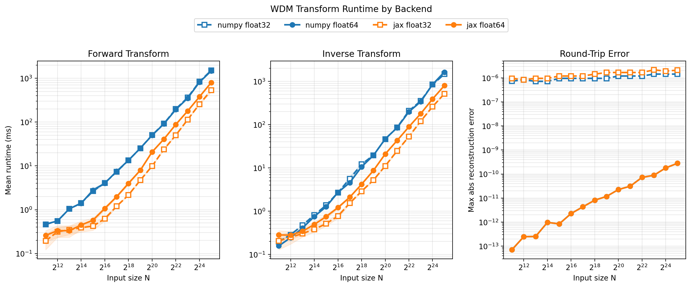

# Benchmarks

This page shows a checked-in benchmark snapshot for the `numpy` and `jax` backends.
The artifacts are generated manually so routine docs builds stay fast and deterministic.
The figure includes forward runtime, inverse runtime, and round-trip reconstruction
error against the original real-valued input signal.



The raw numbers used for the plot are available in
[`benchmark_results.json`](_static/benchmark_results.json).

## Refreshing The Benchmark Snapshot

Regenerate the plot and JSON artifact manually from the repository root:

```bash
uv run python docs/examples/generate_benchmark_plot.py --backends numpy jax
```

If `jax` is not installed in the active environment, the script will warn and only emit the
available backends.

## Notes

- The default snapshot covers `N = 2048` through `1048576` and uses 7 timed runs per point.
- Each measurement uses one warmup call before timed runs.
- JAX timings are synchronized before the timer stops, so they include the actual device work.
- The timing panels show mean runtimes in milliseconds, with a shaded band for one standard deviation.
- The error panel shows the maximum absolute difference after `from_wdm_to_time(from_time_to_wdm(x))`.
