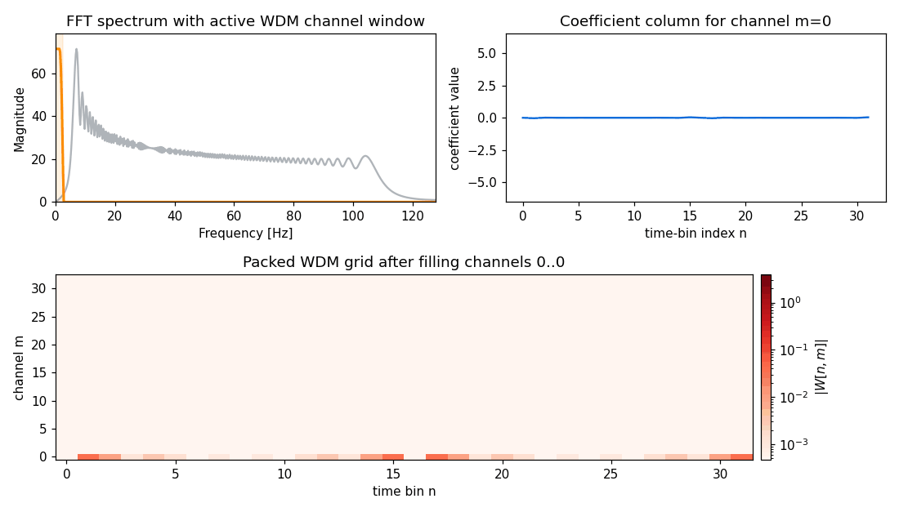

# What Is The WDM Domain?

The Wilson-Daubechies-Meyer (WDM) transform is a time-frequency
representation for a one-dimensional sampled signal.

It sits between two familiar extremes:

- A time series tells you exactly when something happens, but not which
  frequency band it belongs to.
- An FFT tells you exactly which frequencies are present, but not where in time
  they are active.

WDM tries to keep some of both.

## The Core Idea

Instead of representing a signal with only global sine waves, WDM represents it
with a collection of localized atoms `g_{n,m}`:

- `n` indexes a time bin
- `m` indexes a frequency channel

Each coefficient `W[n, m]` says how much the signal looks like that particular
localized atom.

That is why a WDM coefficient grid can be read as a packed time-frequency map.

## Why The Grid Has Shape `(nt, nf + 1)`

For a signal of length

`N = nt * nf`

the transform stores coefficients in a matrix of shape

`(nt, nf + 1)`.

The channels are packed as:

- `m = 0`: DC edge channel
- `m = 1 .. nf - 1`: interior frequency channels
- `m = nf`: Nyquist edge channel

So the extra `+ 1` comes from carrying both edge channels explicitly.

## Reading The Packed Grid

- Moving horizontally changes the time-bin index `n`
- Moving vertically changes the channel index `m`
- Bright coefficients indicate that the signal resembles that localized
  oscillatory atom

In practice, narrow-band features often occupy only a few nearby WDM channels,
while transients stay localized in time instead of being smeared across the
entire FFT.

## Frequency Packetization Animation

The animation below shows one way to interpret the forward transform:

- start from the FFT of the data
- select one active WDM channel window at a time
- compute the corresponding coefficient column
- fill the packed WDM grid channel by channel

## Why This Matters

This view is useful when you want:

- better time localization than an FFT
- a structured coefficient grid that still supports exact reconstruction
- a domain where localized signals can be separated from broadband or
  stationary noise more naturally

For a full worked example, see the study notebook:

- [Sinusoid In Colored Noise](../studies/toymodels/monochrome_stationary_psd.md)
