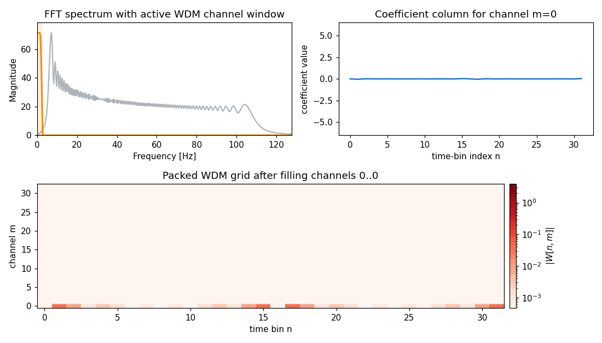

# What Is The WDM Domain?

The Wilson–Daubechies–Meyer (WDM) transform is a discrete wavelet-packet
time-frequency representation for a one-dimensional sampled signal. It
maps $N$ real samples to a packed grid of $N$ real coefficients indexed
by a time bin $n$ and a frequency channel $m$.

It sits between two familiar extremes:

- A time series tells you exactly *when* something happens, but not in which
  frequency band.
- An FFT tells you exactly *which* frequencies are present, but not when they
  are active.

A short-time Fourier transform partially closes this gap with a sliding
window, but imposes a fixed time–frequency resolution across the whole
record. The WDM imposes a fixed resolution too, but uses a smooth
compactly-supported Meyer window and a Wilson-basis pairing of positive and
negative frequencies, yielding **exactly orthonormal** interior atoms and an
**exact, closed-form inverse**.

## The Core Idea

WDM represents the signal with localized atoms $g_{nm}[\ell]$:

- $n = 0, \dots, N_t - 1$ indexes a time bin
- $m = 0, \dots, N_f$ indexes a frequency channel

Each coefficient $w_{nm}$ measures the projection of the signal onto the
atom centred at time bin $n$ and frequency channel $m$:

$$
w_{nm} = \sum_{\ell=0}^{N-1} \tilde x[\ell]\, \tilde g_{nm}^{*}[\ell] .
$$

That is why a WDM coefficient grid can be read as a packed time-frequency
map.

## Why The Grid Has Shape $(N_t,\, N_f + 1)$

For a signal of length

$$
N = N_t \cdot N_f
$$

the transform stores coefficients in a real array of shape
$(N_t,\, N_f + 1)$.

The channels are packed as:

- $m = 0$: **DC edge channel** — uses a doubled time-shift exponent and no
  $C_{nm}$ phase factor
- $m = 1, \dots, N_f - 1$: **interior channels** — alternating phase factor
  $C_{nm}$ pairs positive- and negative-frequency atoms into a single
  real Wilson-orthogonal coefficient
- $m = N_f$: **Nyquist edge channel** — mirrors the DC construction at the
  Nyquist frequency

The interior block stores $N_t (N_f - 1)$ coefficients via the $C_{nm}$
pairing; the two edge channels each contribute $N_t$ unpaired real
coefficients. The total $N_t (N_f + 1)$ stored entries represent the same
$N$ time-domain degrees of freedom, with the edge channels overcomplete by
exactly $N_t$ real numbers.

Both $N_t$ and $N_f$ must be even.

## Orthogonality, Exactly

Unlike many wavelet-packet implementations, the interior WDM atoms
$1 \le m \le N_f - 1$ are **exactly orthonormal to machine precision**:

$$
\sum_{\ell} \tilde g_{nm}^{*}[\ell]\, \tilde g_{pq}[\ell] = \delta_{np}\,\delta_{mq} .
$$

This is what makes the WDM domain well behaved for statistical inference:
for stationary Gaussian noise the coefficient covariance is approximately
diagonal, and the diagonal limit is exact for white noise.

The full packed array including DC and Nyquist is *overcomplete* by $N_t$
real numbers — not non-orthogonal. The redundancy lives entirely in the
edge channels.

## The Inverse Is Closed-Form

Forward followed by inverse returns the original data to floating-point
roundoff. The package implements the explicit inverse

$$
\tilde x[\ell] = \sum_{n=0}^{N_t - 1} \sum_{m=0}^{N_f} \tilde g_{nm}[\ell]\, w_{nm}
$$

with channel-wise formulae for the DC, interior, and Nyquist cases. See
[Reconstruction and Inference](reconstruction-and-inference.md).

## Reading The Packed Grid

- Moving horizontally changes the time-bin index $n$
- Moving vertically changes the channel index $m$
- Bright coefficients indicate that the signal resembles that localized
  oscillatory atom

In practice, narrow-band features often occupy only a few nearby WDM
channels, while transients stay localized in time instead of being
smeared across the entire FFT.

## Frequency Packetization Animation

The animation below shows one way to interpret the forward transform:

- start from the FFT of the data
- select one active WDM channel window at a time
- compute the corresponding coefficient column
- fill the packed WDM grid channel by channel

## Why This Matters

This view is useful when you want:

- better time localization than an FFT
- a structured coefficient grid that still supports exact reconstruction
- a domain where locally stationary noise has an approximately diagonal
  covariance, giving a WDM-Whittle likelihood that naturally accommodates
  slowly-varying spectra

For a full worked example with executable plots, see the walkthrough:

- [WDM Walkthrough](../examples/wdm_walkthrough.py)
