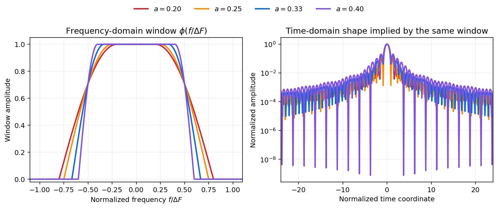
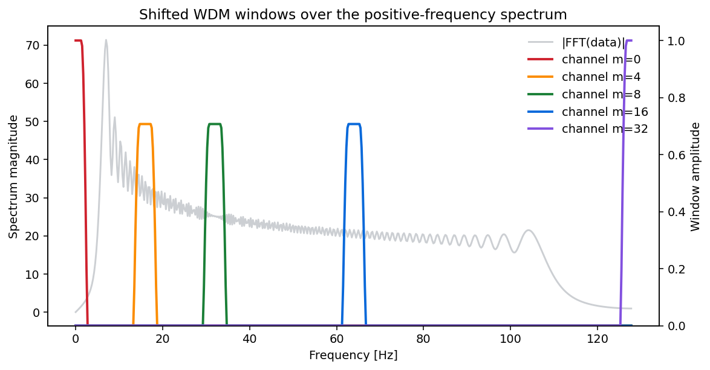
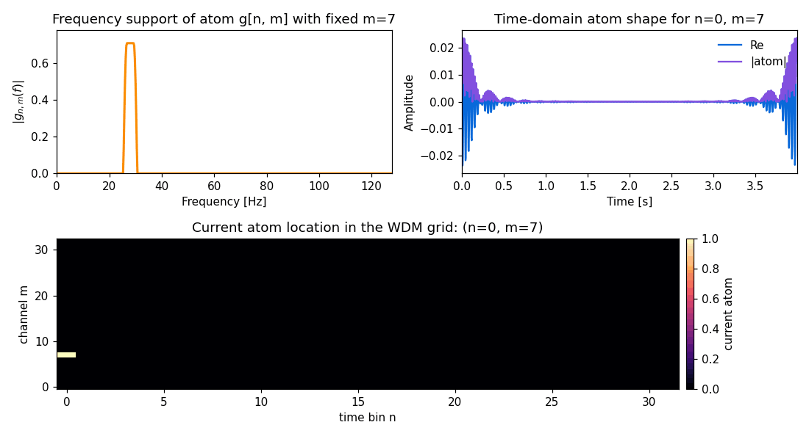
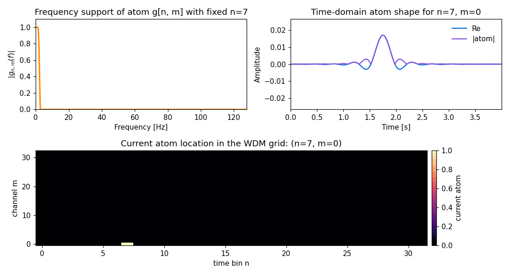

# Windows And Atoms

WDM is built from a cosine-tapered frequency window `phi` and a family of
shifted atoms `g_{n,m}`.

These are the ingredients that make the coefficient grid interpretable.

## The Window `phi`

The package uses a compactly supported frequency-domain window:

- flat in the middle
- smoothly tapered at the edges
- exactly zero outside its support

The roll-off is controlled by the parameter `a`.

- smaller `a`: narrower flat region, broader taper
- larger `a`: broader flat region, narrower taper

In this repository the default choice is `a = 1/3`.

The easiest way to read `a` is:

- smaller `a`: the flat part of the window is narrower and the taper occupies
  more of the band
- larger `a`: the flat part is wider and the taper is tighter

That is visible directly in frequency space, but it also changes the
corresponding time-domain localization. The figure below shows both effects
side by side.

How to interpret it:

- Left panel: the actual cosine-tapered window shape in normalized frequency
  coordinates
- Right panel: a normalized time-domain shape implied by the same `phi`,
  included only to show the localization trend as `a` changes

This is the core tradeoff:

- a broader and flatter frequency window usually gives a more concentrated band
  selection in frequency
- but that also changes how extended the corresponding shape is in time

So `a` is one of the main knobs for how sharply the transform separates nearby
frequencies versus how localized the atoms remain in time.

## Shifted Windows Define The Channels

The same base window is shifted to different channel locations `m`. That is how
WDM separates the signal into localized frequency bands.

The figure below overlays a few shifted windows on top of a sample spectrum.

The interior channels are centered away from DC and Nyquist, while the two edge
channels have a special form because they sit at the boundaries of the sampled
frequency range.

## The Atoms `g_{n,m}`

Once the window is placed at channel `m`, the transform also modulates it in
time.

- `m` changes *where the atom lives in frequency*
- `n` changes *where the atom lives in time*

That is the origin of the two-dimensional WDM grid.

## Why Orthogonality Matters

If two different atoms overlap too strongly, then coefficients stop having a
clean interpretation. A large coefficient could be partly due to leakage from
several neighboring atoms rather than one localized feature.

Near-orthogonality fixes that:

- one atom corresponds to one localized time-frequency pattern
- coefficients can be read more independently
- reconstruction remains stable and well-behaved

The study notebook includes overlap maps that visualize this directly.

## Atom Shift Animation

The animation below keeps one frequency channel fixed and shifts the atom across
time bins. The frequency support stays in the same band, while the time-domain
shape moves across the signal duration.

This is the key intuition behind the `n` index: it is not a sample number, but
a location on the coarser WDM time grid.

## Channel Shift Animation

The complementary animation below keeps one time bin fixed and shifts the atom
through the WDM channels.

This shows the role of `m`:

- the active frequency band moves up and down the spectrum
- the time-localization stays in roughly the same place
- the time-domain atom oscillates faster or slower depending on the channel

So, at a high level:

- changing `n` at fixed `m` moves an atom in time
- changing `m` at fixed `n` moves an atom in frequency

## Implementation Surface

The shared helpers that define these pieces live in:

- `wdm_transform.windows.phi_unit`
- `wdm_transform.windows.phi_window`
- `wdm_transform.windows.gnmf`
- `wdm_transform.windows.cnm`
