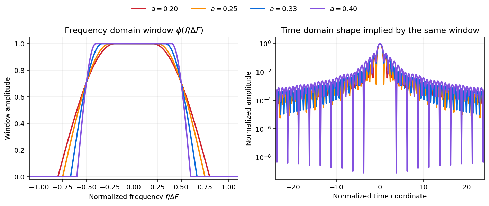
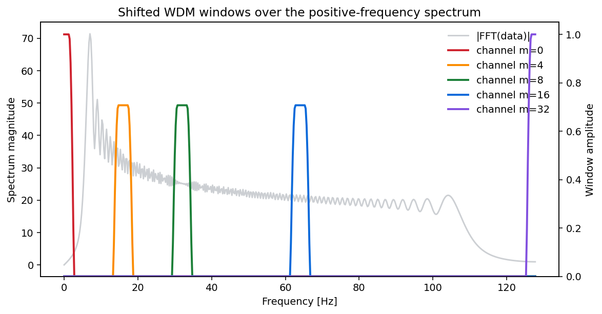
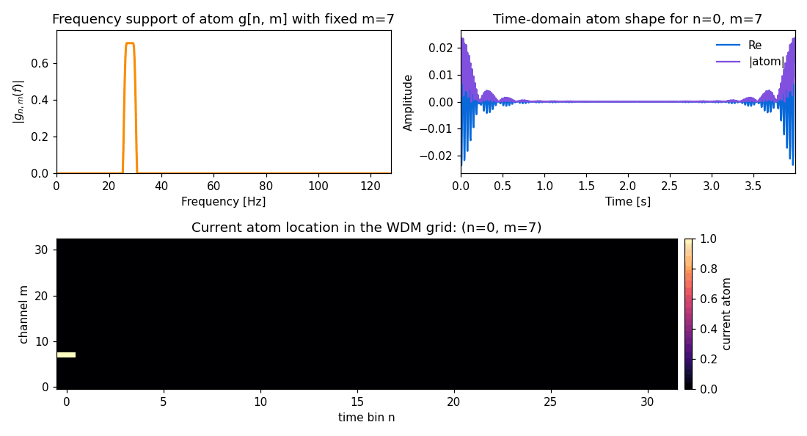
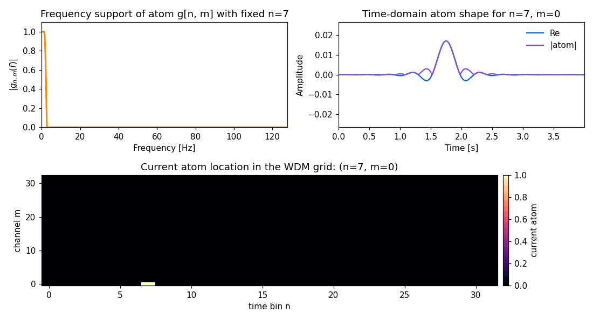

# Windows And Atoms

WDM is built from three ingredients:

- a smooth, compactly supported **Daubechies–Meyer frequency window** $\tilde\varphi$
- a **Wilson-basis pairing** of positive- and negative-frequency atoms
  through a phase factor $C_{nm}$
- a family of shifted, modulated atoms $\tilde g_{nm}$ in the discrete
  frequency domain

These are what make the coefficient grid interpretable and the interior
atoms exactly orthonormal.

## The Daubechies–Meyer Window $\tilde\varphi$

The package uses the discrete frequency-domain window

$$
\tilde\varphi[\ell] = \sqrt{\tfrac{2}{N_t}}
\begin{cases}
1 & |\hat\ell| < A \\
\cos\!\left[\dfrac{\pi}{2}\!\left(\dfrac{|\hat\ell| - A}{B}\right)\right] & A \le |\hat\ell| < A + B \\
0 & \text{otherwise}
\end{cases}
$$

where $\hat\ell = \ell \cdot 2/N_t$ is the normalised frequency bin and

$$
B = 1 - 2A, \qquad A \in (0, 1/2] .
$$

So a single parameter $A$ controls the shape:

- $|\hat\ell| < A$ — flat passband
- $A \le |\hat\ell| < A + B$ — smooth cosine taper to zero
- $|\hat\ell| \ge A + B$ — exactly zero

In code this parameter is exposed as the `a` attribute of the
[`WDM`](../guide/api-overview.md) class. The default is `a = 1/3`. The
window is the $d = 1$ cosine-tapered member of the Meyer family; the
parameter $d$ is retained in the API for possible future
generalisations (e.g. $d = 4$ as in Cornish 2020 gives a flatter passband
at the cost of wider time-domain support).

### How $A$ Trades Off Time vs Frequency Localisation

- **Smaller $A$**: narrower flat passband, longer cosine taper, sharper
  spectral roll-off but broader time-domain support.
- **Larger $A$**: wider flat passband, shorter taper, more compact in time
  but more spectral leakage.

The figure below shows both effects side by side.

- Left panel: the cosine-tapered $\tilde\varphi$ shape in normalised
  frequency coordinates.
- Right panel: the implied time-domain envelope; this is what controls
  how localised each atom is in time.

## Shifted Windows Define The Channels

The same base window is shifted by $mN_t/2$ to define each channel $m$.
Adjacent channels overlap by exactly $50\%$ of their spectral support — that
overlap is what gives the construction its partition-of-unity property and
allows exact reconstruction:

$$
\tilde\varphi^2(f) + \tilde\varphi^2(f - \Delta F) = \frac{1}{\Delta F}
$$

across each overlap region.

## The Atoms $\tilde g_{nm}$

The Wilson-basis atom definition has three cases, matching the packed
$(N_t,\, N_f+1)$ storage:

$$
\tilde g_{nm}[\ell] = \frac{1}{\sqrt 2}
\begin{cases}
e^{-4\pi i n \ell / N_t}\, \tilde\varphi[\ell] & m = 0 \\[2pt]
e^{-2\pi i n \ell / N_t}\Big(C_{nm}\, \tilde\varphi[\ell - m N_t/2] + C_{nm}^{*}\, \tilde\varphi[\ell + m N_t/2]\Big) & 0 < m < N_f \\[2pt]
e^{-4\pi i n \ell / N_t}\Big(\tilde\varphi[\ell - N/2] + \tilde\varphi[\ell + N/2]\Big) & m = N_f
\end{cases}
$$

Note the **doubled time-shift exponent** ($4\pi$ instead of $2\pi$) for the
DC and Nyquist edge channels: those channels oscillate at twice the rate in
$n$ because they see both positive and negative frequency copies of the
window simultaneously.

## The Phase Factor $C_{nm}$

The interior channels use an alternating phase factor

$$
C_{nm} = \exp\!\left[i\tfrac{\pi}{4}\,(1 - (-1)^{n+m})\right]
= \begin{cases} 1 & n+m \text{ even} \\ i & n+m \text{ odd} \end{cases}
$$

This is the **Wilson** part of the construction: it combines the
positive- and negative-frequency windowed atoms at $\pm m N_t / 2$ into a
single real, orthogonal pair. Without $C_{nm}$ the pairing would not yield
real coefficients with the right orthogonality structure.

The forward transform for the interior block can be written compactly as

$$
w_{nm} = \sqrt 2\, (-1)^{nm}\, \Re\!\left[C_{nm}^{*}\, x_m[n]\right]
$$

where $x_m[n]$ is the length-$N_t$ inverse FFT of the windowed spectral
block at channel $m$. The $(-1)^{nm}$ checkerboard sign is what produces
the alternating pattern visible across the coefficient grid.

## Why Orthogonality Matters

The interior atoms satisfy

$$
\sum_{\ell} \tilde g_{nm}^{*}[\ell]\, \tilde g_{pq}[\ell] = \delta_{np}\,\delta_{mq}
$$

**exactly** (to machine precision). This means each interior coefficient
$w_{nm}$ measures the projection onto **one** localised time-frequency
pattern, with no leakage from neighbours in the ideal sense. In practice:

- one atom corresponds to one localised time-frequency cell
- coefficients can be read independently
- forward followed by inverse reconstructs the data to floating-point
  roundoff
- for stationary white noise the coefficient covariance is exactly
  diagonal; for coloured stationary noise it is approximately diagonal,
  with off-diagonal correlations decaying rapidly with $|n - n'|$ and
  $|m - m'|$.

The full packed array is overcomplete only at the DC and Nyquist edges,
which together carry $N_t$ redundant real numbers.

## Atom Shift Animation

Keeping one channel fixed and varying $n$ shifts the atom in time:

## Channel Shift Animation

Keeping one time bin fixed and varying $m$ shifts the atom in frequency:

So, at a high level:

- changing $n$ at fixed $m$ moves an atom in time
- changing $m$ at fixed $n$ moves an atom in frequency

## Implementation Surface

The shared helpers that define these pieces live in:

- `wdm_transform.windows.phi_unit` — the dimensionless cosine taper
- `wdm_transform.windows.phi_window` — $\tilde\varphi$ as evaluated on the
  discrete frequency grid
- `wdm_transform.windows.cnm` — the phase factor $C_{nm}$
- `wdm_transform.windows.gnmf` — the full atom $\tilde g_{nm}$ in the
  three-case form above
