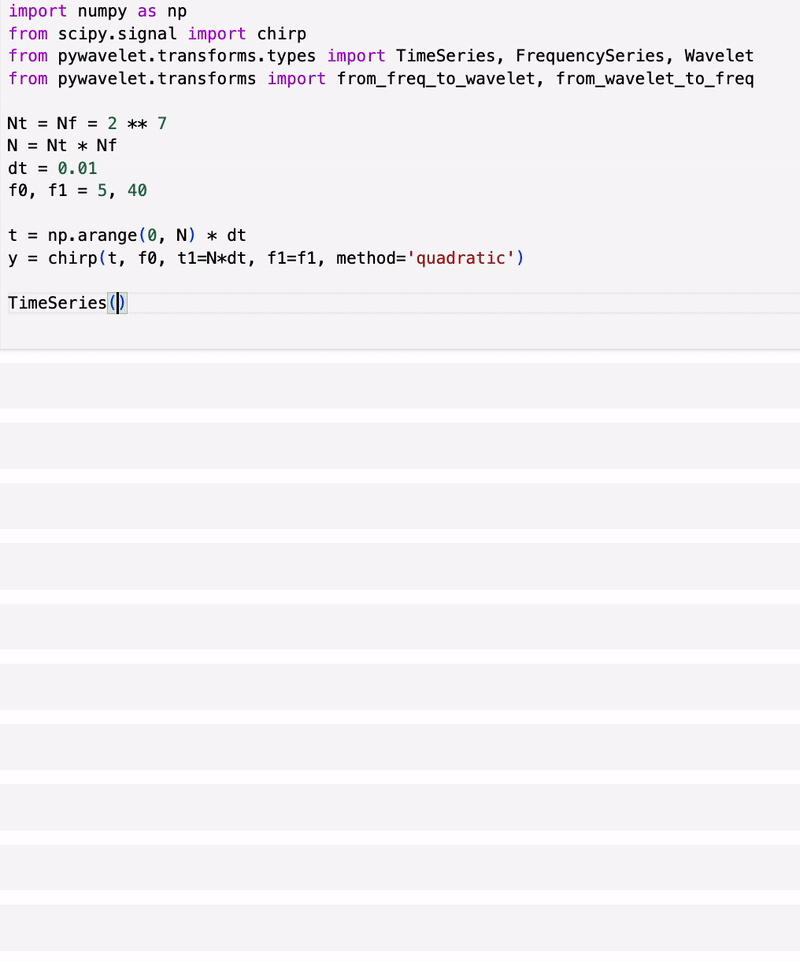

# wdm-transform

`wdm-transform` provides a small object model for moving between sampled time-domain data,
frequency-domain data, and WDM coefficients.

## Core Objects

- `TimeSeries`: sampled one-dimensional time-domain data
- `FrequencySeries`: FFT-domain data with frequency spacing metadata
- `WDM`: real-valued WDM coefficients plus inverse transforms

## Start Here

- Read the API overview for the object model.
- Open the WDM walkthrough for an executed example with plots.
- Check the benchmarks page for a backend runtime snapshot and regeneration command.
- Use the API overview for the conceptual guide plus live signatures and docstrings pulled from the implementation.
