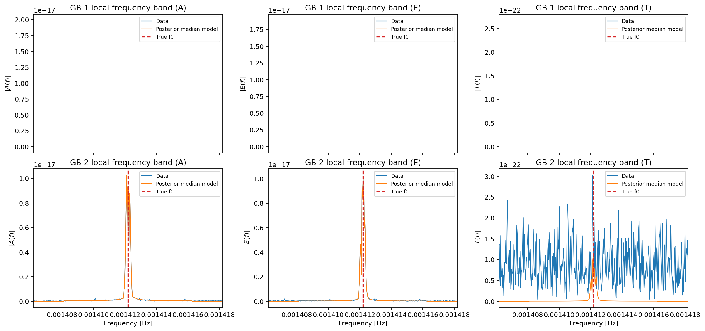
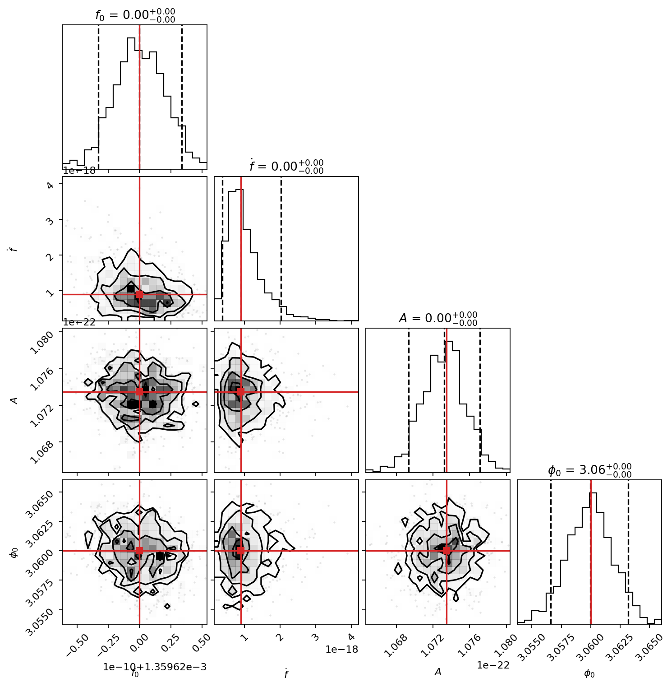
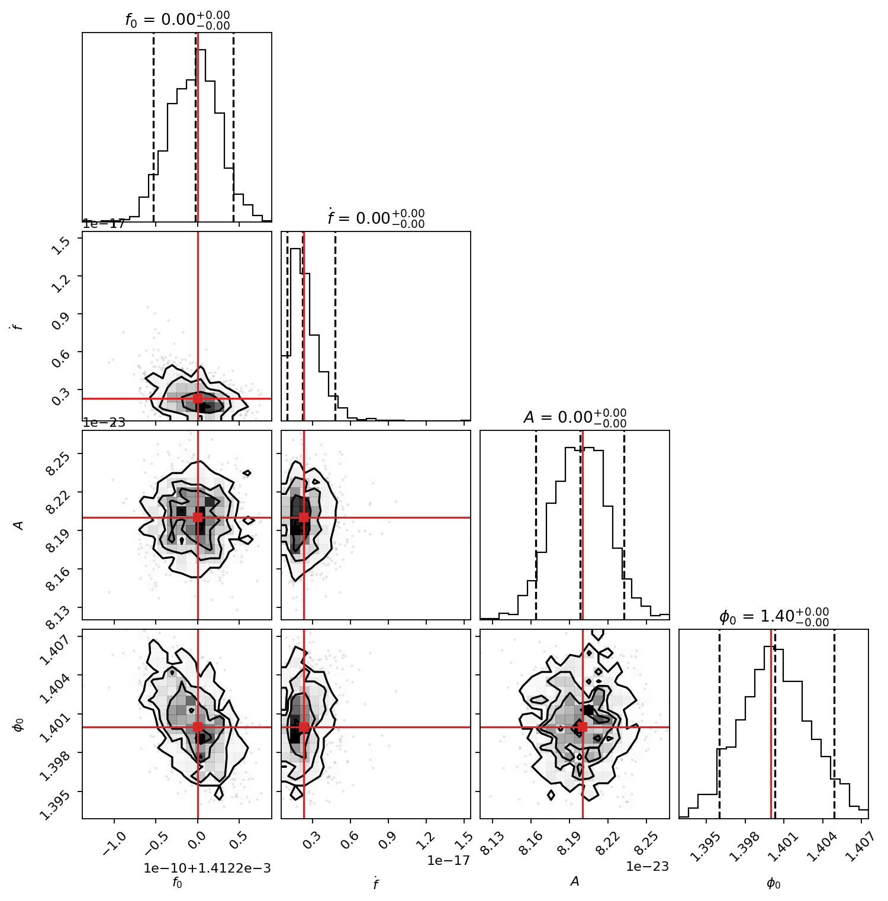
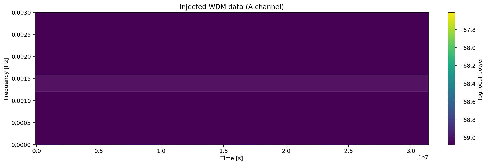
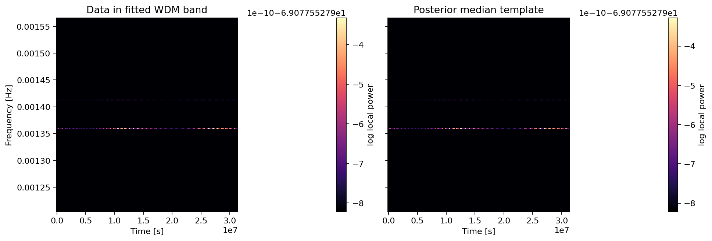
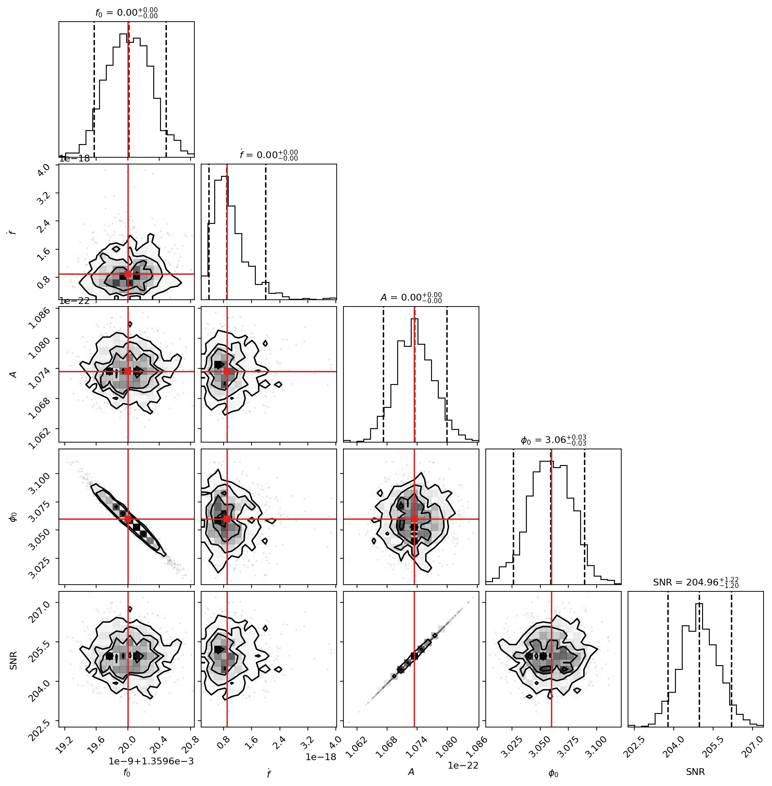
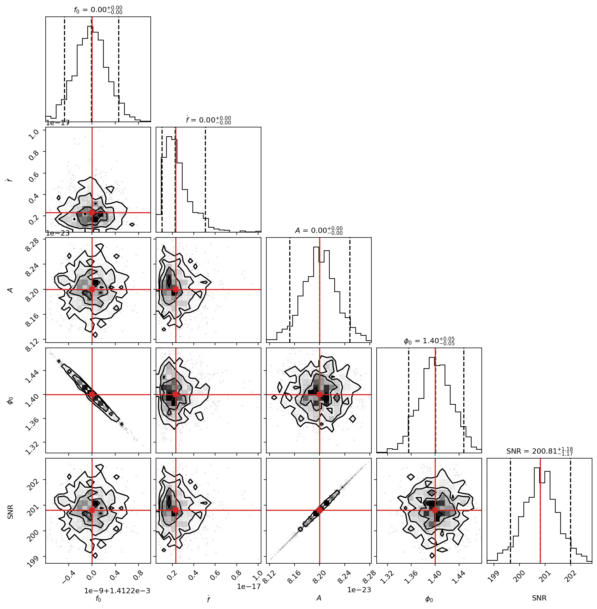
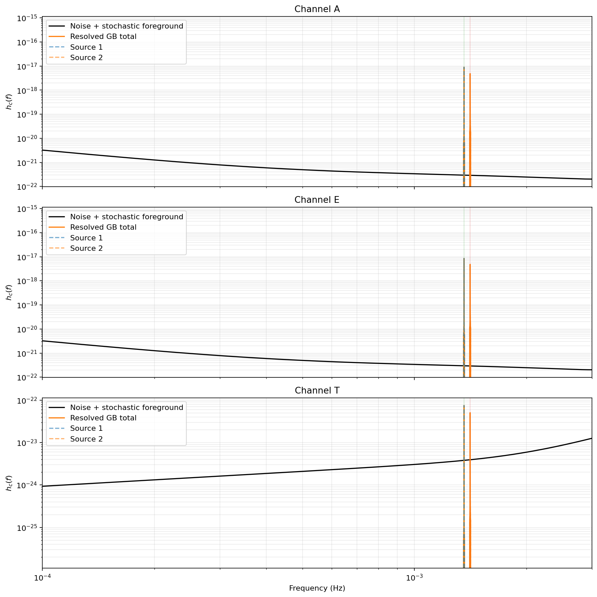

# LISA Galactic-Binary Study

Executable scripts:
[`data_generation.py`](./data_generation.py),
[`lisa_freq_mcmc.py`](./lisa_freq_mcmc.py),
[`lisa_wdm_mcmc.py`](./lisa_wdm_mcmc.py).

This study is organized as a markdown-first case study backed by three plain Python scripts.
The markdown page carries the narrative, the math, and the rendered figures. The scripts are
kept as standalone executables that generate the cached products and posterior diagnostics shown
here.

## Study structure

1. `data_generation.py` builds a toy anisotropic Galactic foreground, computes the sky-averaged
   LISA response, injects two resolved Galactic binaries, and writes
   `outdir_gb_background/injection.npz`.
2. `lisa_freq_mcmc.py` loads that cache and performs two independent local frequency-domain fits
   with a narrow-band Whittle likelihood.
3. `lisa_wdm_mcmc.py` loads the same cache, transforms the injected data to WDM coefficients, and
   performs a joint two-source fit on a restricted time-frequency band.

## How To Run

Run the scripts from the repository root:

```bash
python docs/studies/lisa/data_generation.py
python docs/studies/lisa/lisa_freq_mcmc.py
python docs/studies/lisa/lisa_wdm_mcmc.py
```

`data_generation.py` is the prerequisite step. Both inference scripts read:

- `docs/studies/lisa/outdir_gb_background/injection.npz`

That cache stores the A/E-channel time series, the PSD grids, the injected source parameters, and
the per-source SNR summaries needed by the follow-on fits.

## Data Model

The A-channel strain is modeled as

$$
d_A(t) = n_A(t) + h_\mathrm{gal}(t) + \sum_{i=1}^{2} h_i(t; \theta_i),
$$

where `data_generation.py` simulates the instrumental noise term $n_A$, a stochastic Galactic
foreground $h_\mathrm{gal}$, and two resolved compact-binary signals $h_i$ generated with `JaxGB`.

The foreground PSD is built from a sky map and a response tensor:

$$
S_A(f, t) = S_A^\mathrm{inst}(f) + \left|R_{AA}(f, t)\right| S_\mathrm{gal}(f).
$$

That is why the expensive part of the study lives in `data_generation.py`: it computes and caches
the time-dependent response needed to mix the anisotropic sky model into the detector channels.

## Frequency-Domain Likelihood

For the frequency-domain MCMC, each source is fit in a narrow local band around its injected
carrier frequency. The two binaries are well separated in frequency, so the code treats them as
independent local problems.

If $\tilde d_k$ is the A-channel FFT and $\tilde h_k(\theta)$ is the template restricted to the
same band, the code uses the Whittle approximation

$$
\log p(d \mid \theta)
\propto
-\sum_{k \in \mathcal{B}}
\left[
\log S_k
+
\frac{4 \, \Delta f \, |\Delta t (\tilde d_k - \tilde h_k(\theta))|^2}{S_k}
\right].
$$

The fitted parameters are $(f_0, \dot f, A, \phi_0)$ for each source. Sky position, polarization,
and inclination stay fixed at their injected values so that the comparison isolates the likelihood
machinery rather than a full eight-parameter search.

### Frequency-domain figures

The local-band view checks that the posterior median template lands on top of the observed power in
each source neighborhood.



The posterior corner plots summarize the recovered local parameters for each binary.




## WDM-Domain Likelihood

The WDM run uses the same injected A-channel data after truncating it to a length compatible with
the $(n_t, n_f)$ tiling. The transform produces coefficients

$$
w_{n,m} = \langle d, g_{n,m} \rangle,
$$

where each $g_{n,m}$ is a localized Wilson-Daubechies-Meyer atom centered near time bin $n$ and
frequency bin $m$.

The full likelihood would require the covariance of those coefficients. This study uses a diagonal
approximation calibrated from synthetic stationary-noise draws:

$$
\Sigma_{n,m} \approx \mathrm{Var}[w_{n,m}]
\quad\text{with}\quad
\log p(w \mid \theta)
\propto
-\frac{1}{2}
\sum_{n,m \in \mathcal{B}}
\left[
\frac{(w_{n,m} - h_{n,m}(\theta))^2}{\Sigma_{n,m}}
+
\log\!\left(2\pi \Sigma_{n,m}\right)
\right].
$$

Unlike the FFT fit, the WDM run models both binaries jointly on one shared band because they occupy
the same localized time-frequency patch once projected into the WDM grid.

### WDM-domain figures

The first plot shows the injected data on the WDM grid and the selected analysis band.



The band-limited comparison shows the observed WDM coefficients next to the posterior median model.



The joint fit still produces source-level posteriors, shown here as one corner plot per binary.




## Background Diagnostics

`data_generation.py` writes the cached products above and these diagnostic plots.

| File | Description |
|---|---|
| `galaxy_mollview.png` | Toy HEALPix morphology for the unresolved Galactic population |
| `galaxy_frequency_psd.png` | Foreground PSD converted to an $\Omega_\mathrm{GW}$-like summary |
| `lisa_noise_psd.png` | TDI 1.5 A/E/T instrumental PSDs |
| `channel_a_total_psd.png` | Time-dependent total PSD in channel A |
| `channel_a_noise_vs_galaxy.png` | One A-channel realization against its model components |
| `resolved_gb_vs_noise_characteristic_strain.png` | Injected resolved binaries overlaid on characteristic noise strain |




## Notes

- `data_generation.py` is the expensive step because it computes and caches the response tensor
  before injecting the resolved binaries.
- JAX is imported inside `main()` in `data_generation.py` only after the multiprocessing pools
  finish, avoiding the JAX-plus-fork failure mode.
- `lisa_freq_mcmc.py` and `lisa_wdm_mcmc.py` are now ordinary scripts rather than notebook-style
  percent files.
- The page below includes the live source for the generation script and both MCMC drivers, so the
  docs build exposes the exact code used to produce the study outputs.

## Source Code

### `data_generation.py`

```python
--8<-- "docs/studies/lisa/data_generation.py"
```

### `lisa_freq_mcmc.py`

```python
--8<-- "docs/studies/lisa/lisa_freq_mcmc.py"
```

### `lisa_wdm_mcmc.py`

```python
--8<-- "docs/studies/lisa/lisa_wdm_mcmc.py"
```
