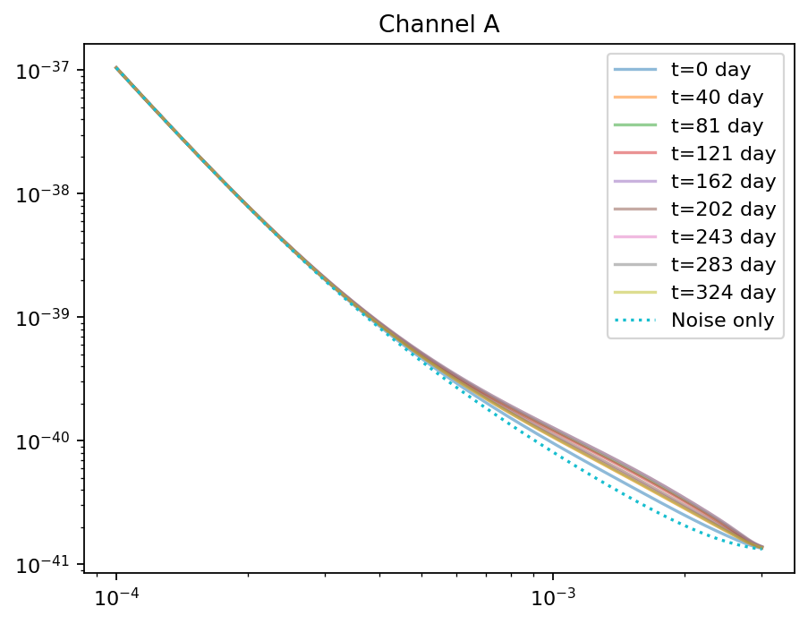
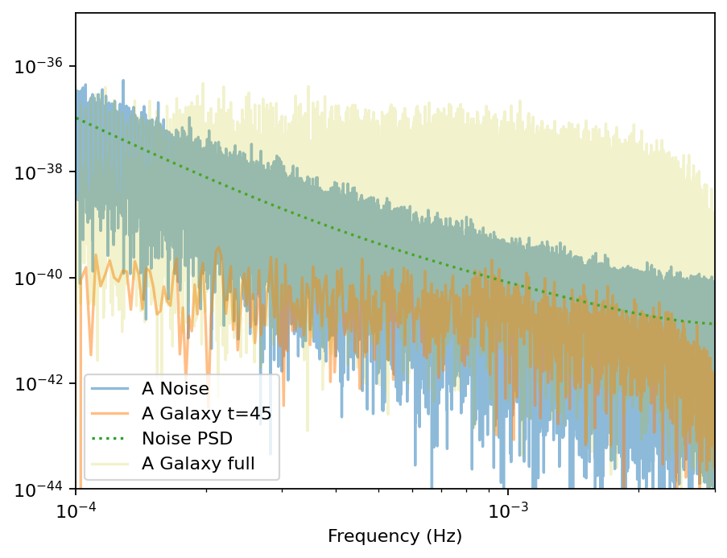
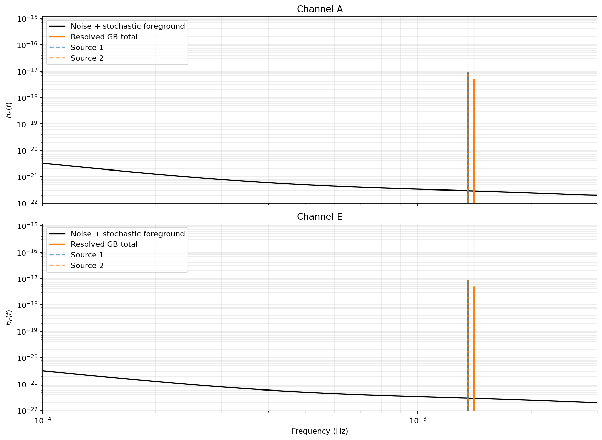

# LISA Galactic-Binary Study

Executable scripts:
[`data_generation.py`](./data_generation.py),
[`lisa_mcmc.py`](./lisa_mcmc.py), and
[`collect_jsd.py`](./collect_jsd.py).

This study is organized as a markdown-first case study backed by a small set of plain Python scripts.
The markdown page carries the narrative, the math, and the rendered figures. The scripts are
kept as standalone executables that generate the cached products and posterior diagnostics shown
here.

## Study structure

1. `data_generation.py` builds a toy anisotropic Galactic foreground, computes the sky-averaged
   LISA response, injects one seeded resolved Galactic binary with true frequency drawn from a
   small jitter around a fixed external reference frequency `f_ref`, and writes
   `outdir_lisa/<mode>/seed_<LISA_SEED>/injection.npz`.
2. `lisa_mcmc.py` loads that cache and performs one local frequency-domain fit with a
   narrow-band Whittle likelihood.
3. The same script transforms the injected data to WDM coefficients and
   performs one per-source fit on a narrow WDM band (mirroring the frequency-domain
   approach). Uses $n_t = 32$ by default for inference.
4. The final comparison step writes
   diagnostics, including marginal Jensen-Shannon divergence.
5. `collect_jsd.py` aggregates the per-seed JSD diagnostics into a CSV, JSON summary, and
   histogram.

## How To Run

Run the scripts from the repository root:

```bash
LISA_SEED=0 python docs/studies/lisa/data_generation.py
python docs/studies/lisa/lisa_mcmc.py
```

To generate an instrument-only stationary-noise injection without the stochastic Galactic foreground:

```bash
LISA_SEED=0 LISA_INCLUDE_GALACTIC=0 python docs/studies/lisa/data_generation.py
```

Useful overrides:

```bash
LISA_SEED=3 python docs/studies/lisa/data_generation.py
LISA_N_WARMUP=400 LISA_N_DRAWS=600 LISA_NT=32 python docs/studies/lisa/lisa_mcmc.py 3
python docs/studies/lisa/collect_jsd.py --mode stationary_noise --start-seed 0 --end-seed 9
```

`data_generation.py` is the prerequisite step. `lisa_mcmc.py` reads:

- `docs/studies/lisa/outdir_lisa/<mode>/seed_<LISA_SEED>/injection.npz`

That cache stores the A/E/T time series, the PSD grids, the injected source parameters, the fixed
reference frequency `f_ref`, the injected `delta_logf0_true`, the local follow-up prior bounds,
the generation seed, and the SNR summary needed by the follow-on fits.

All outputs from the three scripts for a given run now live in the same directory:

- `docs/studies/lisa/outdir_lisa/stationary_noise/seed_1/` for `LISA_INCLUDE_GALACTIC=0 LISA_SEED=1`
- `docs/studies/lisa/outdir_lisa/galactic_background/seed_1/` for `LISA_INCLUDE_GALACTIC=1 LISA_SEED=1`

Typical files are:

- `injection.npz`
- `freq_posterior.nc`
- `wdm_posterior.nc`
- `freq_trace.png`
- `wdm_trace.png`
- `posterior_diagnostics/posterior_diagnostics.json`
- `posterior_diagnostics/posterior_dist.pdf`

The expensive response-tensor cache is now shared across runs:

- `docs/studies/lisa/outdir_lisa/_cache/Rtildeop_tf.npz`

## Data Generation

### Data Model

The A-channel strain is modeled as

$$
d_A(t) = n_A(t) + h_{\mathrm{gal}}(t) + h(t; \theta)
$$

where the instrumental noise term $n_A$, the stochastic Galactic foreground $h_{\mathrm{gal}}$, 
and the single resolved compact-binary signal $h$ are generated with a seed-controlled draw.

This is a conditional local-follow-up study, not a discovery search over broad carrier frequency.
The scripts assume an external matched-filter stage has already localized the source near a fixed
reference frequency $f_{\rm ref}$, and the injected true carrier is drawn as a small log-jitter
around that reference:

$$
f_0 = f_{\rm ref} \exp(\delta \log f_0),
\qquad
\delta \log f_0 \sim \mathrm{Uniform}[-w, +w].
$$

The same jitter width is then used in both the frequency-domain and WDM-domain posteriors.

The foreground PSD is built from a sky map and a response tensor:

$$
S_A(f, t) = S_A^{\mathrm{inst}}(f) + |R_{AA}(f, t)| S_{\mathrm{gal}}(f)
$$

The expensive part is that we must compute and cache the time-dependent response tensor needed 
to mix the anisotropic sky model into the detector channels.

### Background Diagnostics

`data_generation.py` generates the following diagnostic plots:

**Galactic morphology and noise properties:**


**Channel A: time-dependent components and injections:**





**Resolved binary injections relative to characteristic noise strain:**



### Source Code: `data_generation.py`

```python
--8<-- "docs/studies/lisa/data_generation.py"
```

## Frequency-Domain MCMC

### Likelihood

For the frequency-domain MCMC, the injected source is fit in a narrow local band around its
carrier frequency.

If $\tilde{d}_k$ is the A-channel FFT and $\tilde{h}_k(\theta)$ is the template restricted to the
same band, the code uses the Whittle approximation:

$$
\log p(d \mid \theta) \propto
-\sum_{k \in \mathcal{B}} \left[
\log S_k + \frac{4 \Delta f |\Delta t (\tilde{d}_k - \tilde{h}_k(\theta))|^2}{S_k}
\right]
$$

The fitted parameters are $(f_0, \dot{f}, A, \phi_0)$ for the injected source. Sky position,
polarization, and inclination stay fixed at their injected values to isolate the local likelihood
machinery rather than perform a full eight-parameter search. In both inference scripts, `f0` is
represented internally as a local offset around the fixed external reference `f_ref`. The current
study default uses a narrow absolute prior width of `delta_f0 = f0 - f_ref ∈ [-3e-8, 3e-8] Hz`
via `LISA_DELTA_F0_PRIOR_HALF_WIDTH`.

The current local samplers work directly with a narrow frequency offset plus physical source
parameters, using `(delta_f0, logfdot, logA, phi0)` in the frequency-domain run and
`(delta_logf0, logfdot, logA, phi0)` in the WDM-domain run.

### Outputs

`lisa_mcmc.py` writes the frequency-domain posterior archive and sampler diagnostics.
Posterior comparison diagnostics are written by the same script, and repeated-seed JSD aggregation in
`collect_jsd.py`.

### Source Code: `lisa_mcmc.py`

```python
--8<-- "docs/studies/lisa/lisa_mcmc.py"
```

## WDM-Domain MCMC

### Likelihood

The WDM run uses the same injected A-channel data after truncating it to a length compatible with
the $(n_t, n_f)$ tiling. The transform produces coefficients:

$$
w_{n,m} = \langle d, g_{n,m} \rangle
$$

where each $g_{n,m}$ is a localized Wilson-Daubechies-Meyer atom centered near time bin $n$ and
frequency bin $m$.

The full likelihood would require the covariance of those coefficients. This study uses a diagonal
approximation with analytic per-pixel variance $\Sigma_{n,m} = S_n(f_m) \cdot f_{\rm Nyq}$:

$$
\log p(w \mid \theta) \propto -\frac{1}{2}
\sum_{n,m \in \mathcal{B}} \left[
\frac{(w_{n,m} - h_{n,m}(\theta))^2}{\Sigma_{n,m}} + \log(2\pi \Sigma_{n,m})
\right]
$$

Like the frequency-domain run, the injected binary is fit on a narrow local band around the fixed
external reference `f_ref`.

### Fast WDM forward model

The naive WDM template path would:

1. build the full rFFT template,
2. inverse FFT back to the time domain,
3. apply the full WDM transform,
4. then crop to the local band used for inference.

That is much more work than we need inside NUTS. The current script instead:

1. asks `JaxGB` only for the local FFT bins that contain the source,
2. embeds those bins into a small local FFT buffer,
3. applies only the WDM channels that intersect the local inference band.

In operator form, if $P_{\mathcal B}$ is the local FFT crop and $W_{\mathcal B}$ is the band-limited
WDM transform, the template path used by the script is

$$
h^{\rm WDM}_{n,m}(\theta) = W_{\mathcal B} \, P_{\mathcal B} \, \tilde h(\theta),
$$

which is algebraically equivalent to the full transform restricted to the same band, but much
cheaper to evaluate.

### Tiling choice

The WDM tiling parameter $n_t$ sets the frequency channel spacing
$\Delta f_{\rm wdm} = n_t / (2 T_{\rm obs})$ and the number of time bins.

For the current study, the default choice is $n_t = 32$, which gives

$$
\Delta f_{\rm wdm} \approx 5.1 \times 10^{-7}\ {\rm Hz}
$$

for a one-year observation. That is coarse compared to the FFT bin width, but still fine enough
for these narrow local fits once the likelihood normalization and sampler parameterization are set
up correctly.

### What We Fixed

The current WDM script is the result of a few debugging passes. The important fixes were:

1. Keep essentially the full observation time. Earlier versions threw away a large chunk of the
   year when forcing WDM-friendly lengths, which broadened the WDM posterior immediately.
2. Fit the injected source on its own narrow local band instead of carrying a multi-source loop.
3. Use the correct diagonal WDM noise variance,

   $$
   \mathrm{Var}[w_{n,m}] = \frac{S_n(f_m)}{2 \Delta t} = S_n(f_m)\,f_{\rm Nyq},
   $$

   not a naive `PSD × Δf_wdm` estimate.
4. Condition the local `f0` coordinate on the same fixed external reference frequency used by the
   frequency-domain script instead of re-estimating it from the data.
5. Most importantly, sample the waveform phase directly as `phi0` in the same convention used by
   the frequency-domain script. Earlier WDM sampler variants used a midpoint-phase
   reparameterization that could settle into visibly offset $A$, $\phi_0$, and SNR posteriors even
   when the underlying WDM likelihood normalization was correct.

Checked-in study artifacts should be treated as snapshots rather than guaranteed current truth: if
you change the sampler or diagnostics, regenerate the WDM and frequency outputs before relying on
the comparison figures below.

### Outputs

`lisa_mcmc.py` writes the WDM posterior archive after the frequency-domain run. Plotting is handled
after both inference runs finish.

The WDM and frequency-domain paths share the source shown above.

Summary comparison artifacts are written alongside the seed outputs:

- `lisa/outdir_lisa/galactic_background/seed_0/posterior_marginals_compare.png`
- `lisa/outdir_lisa/galactic_background/seed_0/posterior_interval_compare.png`

## Comparison of Methods

### Results

To assess the two inference approaches (frequency-domain vs. WDM-domain),
`lisa_mcmc.py` loads both posterior files and produces diagnostics.

**Marginal posterior distributions:**


The intended result is that the WDM and frequency-domain posteriors overlap closely in all four
fitted source parameters. If the checked-in figures do not show that
behavior, treat them as stale outputs and rerun the study scripts before drawing conclusions about
the WDM representation.

To generate these figures, run:

```bash
python docs/studies/lisa/lisa_mcmc.py
```

This compares the WDM and frequency-domain posteriors for seed 0 by default. Pass a seed number,
for example `python docs/studies/lisa/lisa_mcmc.py 3`, to run another seed.

## Notes

- `data_generation.py` is the expensive step because it computes and caches the response tensor
  before injecting the resolved binaries.
- JAX is imported inside `main()` in `data_generation.py` only after the multiprocessing pools
  finish, avoiding the JAX-plus-fork failure mode.
- `lisa_mcmc.py` is now an ordinary script rather than a notebook-style percent file.
- The shared helper file `lisa_common.py` now holds the common prior metadata, truth-vector, and
  posterior-output helpers used by both inference scripts.
- The page above includes the live source for the study scripts, so the docs build exposes the
  exact code used to produce the study outputs.
