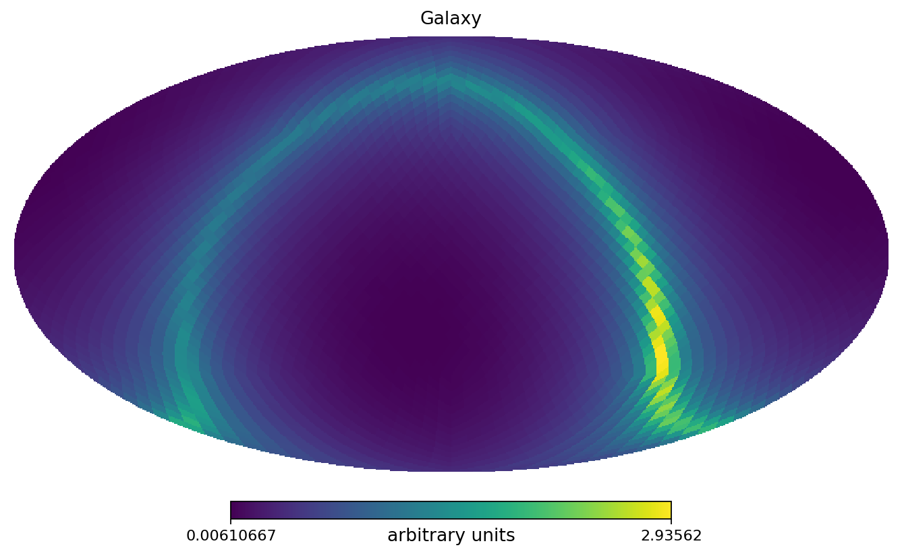
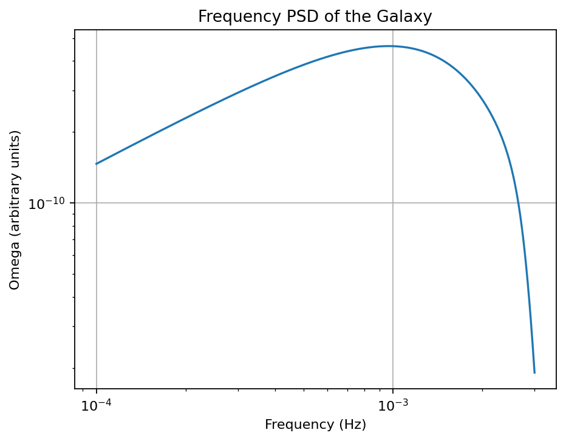
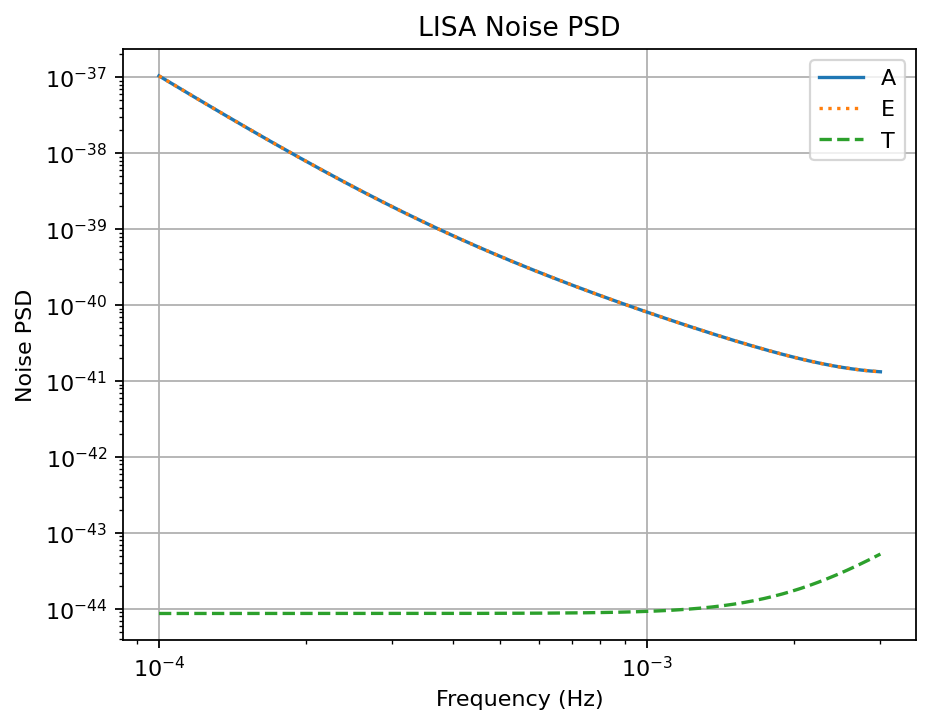

# LISA Galactic-Binary Study

This directory contains a compact LISA study built around three scripts:

1. `data_generation.py` builds a toy anisotropic galactic-binary background and caches the response tensor plus one TDI 1.5 realization.
2. `lisa_freq_mcmc.py` injects two resolved Galactic binaries into the cached A-channel background and fits them in the frequency domain with a local Whittle likelihood.
3. `lisa_wdm_mcmc.py` fits a similar two-source problem directly on WDM coefficients.

The scripts are meant to be readable as documentation pages and runnable as standalone study scripts.

## Layout

| File | Purpose |
|---|---|
| `data_generation.py` | Background simulation, PSD model, response-tensor cache, diagnostic plots |
| `lisa_freq_mcmc.py` | Frequency-domain inference with `JaxGB` + `NumPyro` |
| `lisa_wdm_mcmc.py` | WDM-domain inference with `JaxGB` + NumPyro WDM Whittle likelihood |
| `lisa_common.py` | Shared local helpers for paths, PSDs, and figure output |
| `outdir_gb_background/` | Cached background products and diagnostic figures |

## Workflow

Run the scripts from the repository root:

```bash
python docs/studies/lisa/data_generation.py
python docs/studies/lisa/lisa_freq_mcmc.py
python docs/studies/lisa/lisa_wdm_mcmc.py
```

The first script is the prerequisite. The two inference scripts expect:

- `docs/studies/lisa/outdir_gb_background/tdi15_background_realization.npz`
- `docs/studies/lisa/outdir_gb_background/Rtildeop_tf.npz`

## Background Products

`data_generation.py` produces the cached files above and writes these diagnostic plots:

| File | Description |
|---|---|
| `galaxy_mollview.png` | HEALPix map of the toy galactic morphology |
| `galaxy_frequency_psd.png` | Galactic foreground PSD converted to an Omega-like spectrum |
| `lisa_noise_psd.png` | TDI 1.5 A/E/T instrumental PSDs |
| `channel_a_total_psd.png` | Channel-A total PSD across representative times |
| `channel_a_noise_vs_galaxy.png` | One random A-channel realization compared with noise and galactic components |

### Existing Plots






## Notes

- `data_generation.py` is the expensive step because it computes and caches the sky-averaged response tensor.
- `lisa_freq_mcmc.py` uses `JaxGB`, `lisaorbits`, `NumPyro`, and `corner`.
- `lisa_wdm_mcmc.py` uses `JaxGB`, the JAX WDM transform, and NumPyro for the WDM-domain posterior.
- Both inference scripts now share common local helpers through `lisa_common.py`, so path handling and TDI-noise conventions stay consistent.

## Source: `data_generation.py`

```python
--8<-- "docs/studies/lisa/data_generation.py"
```

## Source: `lisa_freq_mcmc.py`

```python
--8<-- "docs/studies/lisa/lisa_freq_mcmc.py"
```

## Source: `lisa_wdm_mcmc.py`

```python
--8<-- "docs/studies/lisa/lisa_wdm_mcmc.py"
```
