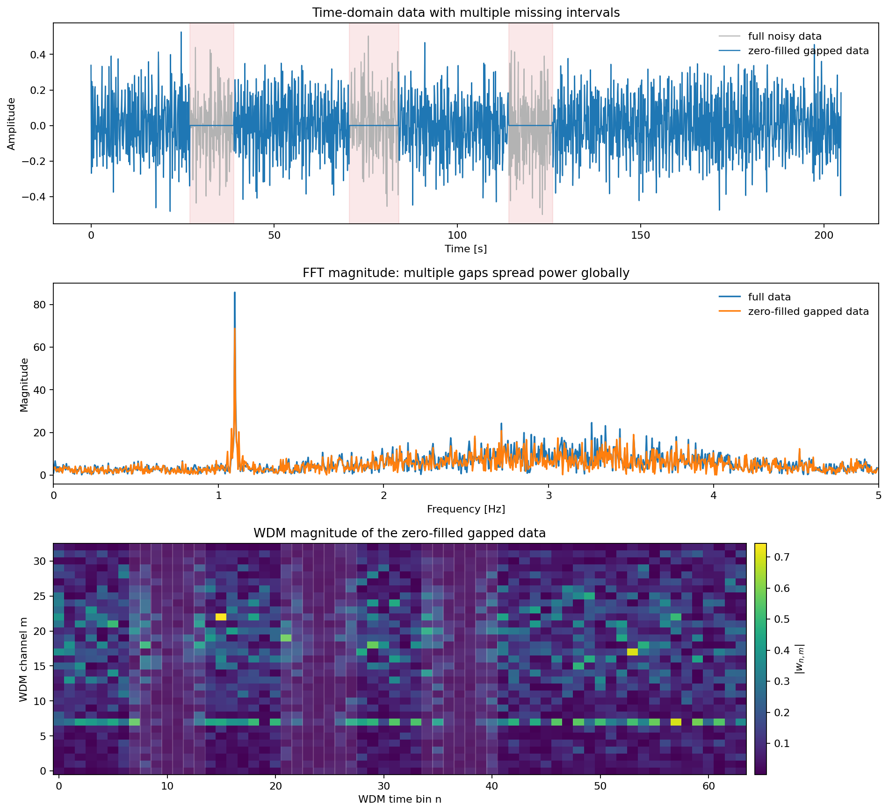
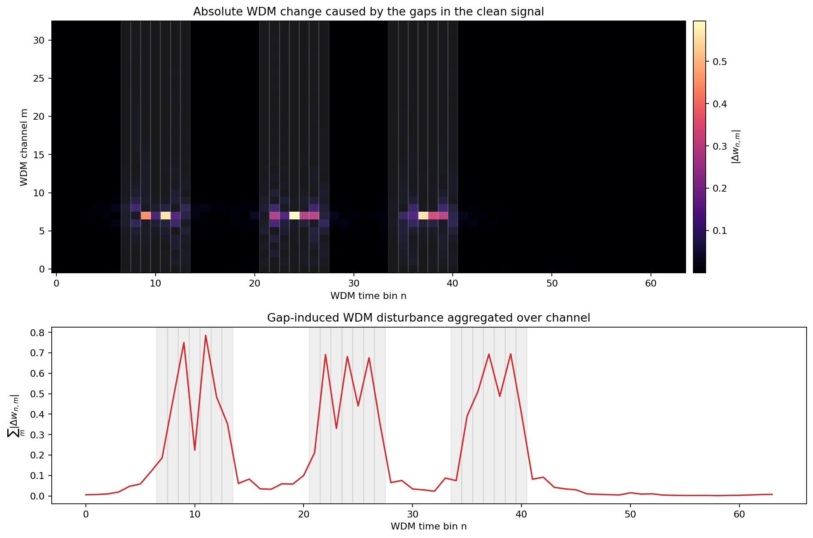
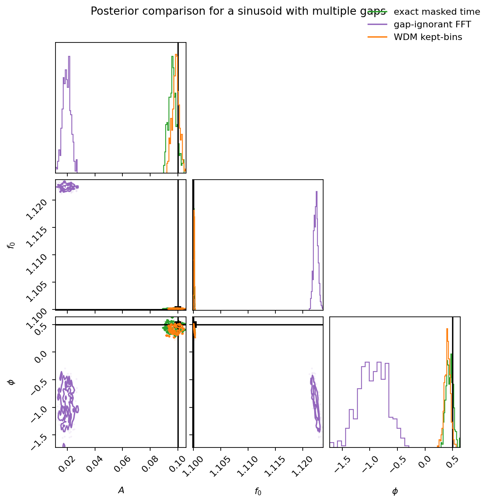
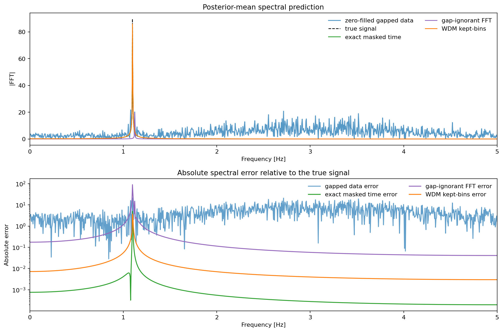

# Sinusoid with Gaps

Executable script: [`monochrome_gaps.py`](./monochrome_gaps.py).


This study upgrades the earlier toy gap example into a harder case:

- one persistent sinusoid
- the same stationary colored-noise PSD used in the colored-noise sinusoid study
- several missing intervals

The point is not that WDM magically contains more information than the time
domain. The point is that gaps are local in WDM coordinates, while they
become globally awkward in the FFT domain.

We compare three inference strategies:

- an **exact masked time-domain likelihood** for the colored-noise model
- a **gap-ignorant FFT likelihood** that treats the zero-filled data as if it
  were complete
- a **localized WDM likelihood** that drops only the contaminated WDM time bins

In this harder setting the WDM method should not beat the exact benchmark, but
it should have a better chance of tracking it than the gap-ignorant FFT treatment.

## Synthetic data with multiple gaps and stationary colored noise

We use almost the same setup as the colored-noise sinusoid study, but now add
several missing intervals and a longer total duration. This makes the
comparison easier to interpret because the main difference is the gaps, not a
completely different signal/noise regime.

The mismatch numbers above are the key locality check:

- outside the gap-adjacent WDM bins, zero-filling does not change the clean
  signal very much
- inside those bins, the effect is large

That is why a localized WDM likelihood is a plausible approximation here.

## Time, FFT, and WDM views

With several gaps, the time-domain issue is obvious. In the FFT, however, the
effect is global: the masked data no longer looks like a clean narrowband line
plus stationary colored noise. In WDM, the disturbance is still concentrated
in a limited set of time bins.



## Gap locality in WDM space

The plots below compare the clean sinusoid to the same signal after
zero-filling the gaps. The contamination is concentrated near a subset of WDM
time bins rather than being spread across the full grid.



## Posterior comparison

Here the exact benchmark is no longer trivial:

- the stationary colored noise is diagonal in the *complete-data* frequency basis
- once we remove samples, the exact observed-data likelihood becomes dense

We therefore compare:

- **exact masked time-domain**: whiten the observed samples with the true
  colored-noise covariance submatrix
- **gap-ignorant FFT**: fit the zero-filled spectrum as if the data were complete
- **WDM kept-bins**: keep only the channels around the signal and drop the WDM
  time bins touched by the gaps

The exact masked-time result is the benchmark. The question is not whether WDM
beats it; it should not. The question is whether the WDM approximation lands
nearer to that benchmark than the gap-ignorant FFT treatment while using a much more
local nuisance model.

In the current synthetic run, the WDM approximation tracks the benchmark much
better in amplitude than the gap-ignorant FFT fit, but it
still shows its own approximation error and needs a variance-inflation factor.



## Posterior-mean prediction in the frequency domain

The posterior means below are shown in the FFT domain rather than the time
domain. That view is more relevant here because the main failure mode of the
gap-ignorant FFT treatment is spectral leakage and amplitude bias.



## Run log

This section is generated from the script's `print()` output.

<!-- BEGIN GENERATED RUN LOG -->
```text
Adjusted WDM tiling from nt=48 to nt=64 so that n_total=2048 factors into an even (nt, nf)=(64, 32) grid.
WDM shape: (64, 33)
Gap intervals: 270:390 (27.0s to 39.0s), 705:840 (70.5s to 84.0s), 1140:1260 (114.0s to 126.0s)
Dominant signal channel: m=7
Selected channels for WDM inference: [5, 6, 7, 8, 9] (centers near [0.78125 0.9375  1.09375 1.25    1.40625])
Excluded WDM time bins: [7, 8, 9, 10, 11, 12, 13, 21, 22, 23, 24, 25, 26, 27, 34, 35, 36, 37, 38, 39, 40]
Relative clean-signal WDM mismatch outside excluded bins: 4.448e-02
Relative clean-signal WDM mismatch inside excluded bins : 7.498e-01
Posterior mean ± std
  exact masked time : A=0.0962±0.0030, f0=1.10009±0.00008, phi=0.4445±0.0614
  gap-ignorant FFT : A=0.0196±0.0028, f0=1.12244±0.00040, phi=-0.9410±0.2487, sigma=0.0253±0.0004
  WDM kept-bins    : A=0.0984±0.0025, f0=1.10012±0.00007, phi=0.4058±0.0520, sigma=0.8934±0.0447
```
<!-- END GENERATED RUN LOG -->
