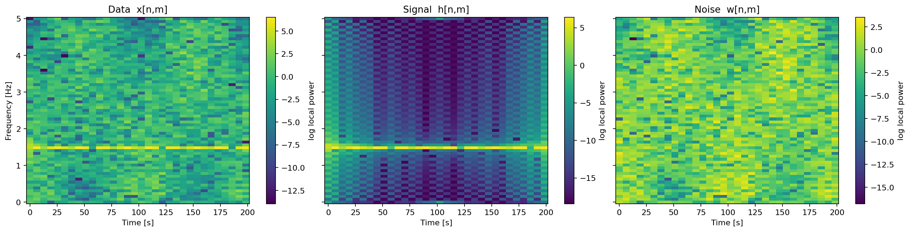
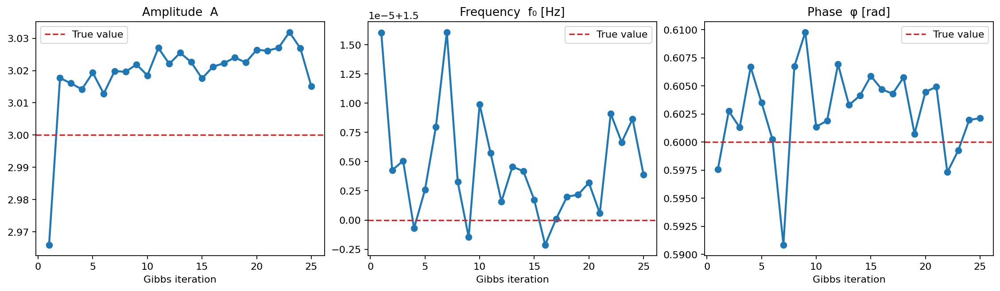
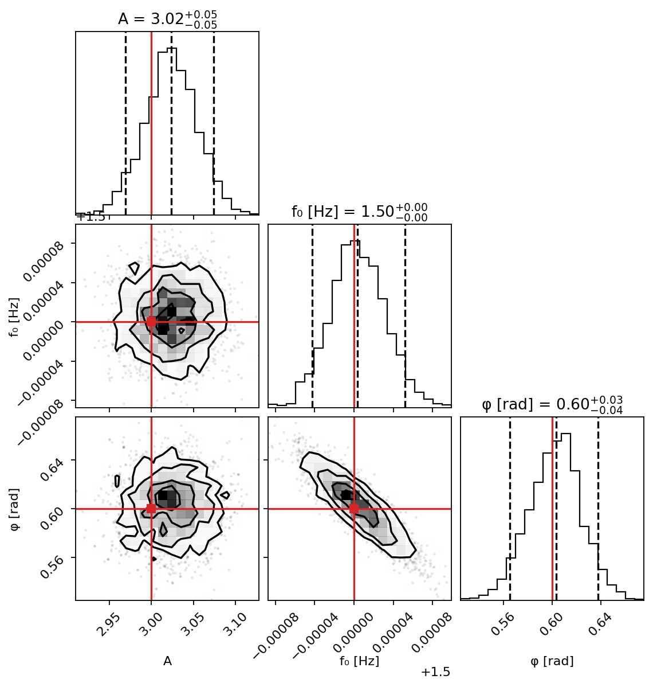
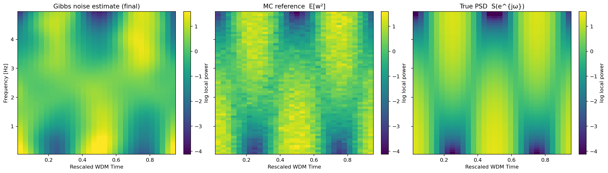
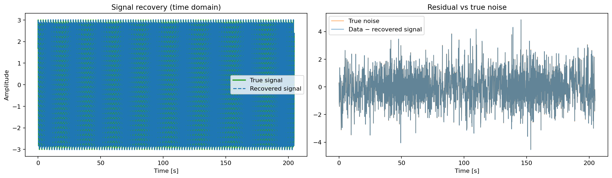
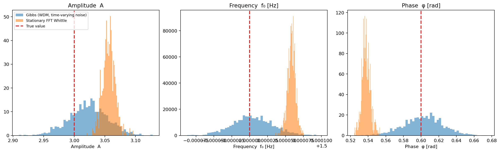

# Monochromatic Signal in Time-Varying Noise: Gibbs Sampler

Executable script: [`monochrome_tv_psd.py`](./monochrome_tv_psd.py).


This notebook demonstrates joint inference of a monochromatic signal embedded
in locally stationary (time-varying) noise using a **block Gibbs sampler** on
the WDM coefficient grid.

The observation model is

$$
x(t) = h(t;\,A,f_0,\varphi) + n(t),
$$

where the signal is a pure sinusoid

$$
h(t) = A\sin(2\pi f_0 t + \varphi)
$$

and the noise $n(t)$ is a locally stationary process whose time-varying PSD
$S[n,m]$ is **unknown** and must be estimated alongside the signal parameters.

After transforming to the WDM domain the observation becomes

$$
x[n,m] \approx h[n,m] + w[n,m], \qquad w[n,m] \sim \mathcal{N}(0,\,S[n,m]),
$$

which decouples into two tractable conditional posteriors:

| Block | Condition on | Target |
|-------|-------------|--------|
| **Signal** | current $S[n,m]$ | $(A, f_0, \varphi)$ via WDM Whittle |
| **Noise** | current $(A,f_0,\varphi)$ | $S[n,m]$ via WDM Whittle on residual |

Each block is sampled with NUTS; the two blocks alternate in a standard block
Gibbs schedule.

## Shared helpers

`simulate_tv_arma`, `PSplineConfig`, `compute_true_tv_psd`,
`monte_carlo_reference_wdm_psd`, and `run_wdm_psd_mcmc` are loaded from the
sibling PSD notebook. Only the function-definition cells are executed —
the experiment block is excluded so docs builds stay fast.

## Problem setup

## Data overview



## JAX-differentiable WDM signal template

The signal block needs to evaluate $h[n,m] = \mathrm{WDM}(h(t; A, f_0,
\varphi))$ inside a NumPyro model, so it must be JAX-traceable.  We use the
JIT-compiled `_from_spectrum_to_wdm_impl` kernel directly with a precomputed
phi-window.

## Gibbs sampler components

### Block 1 — Signal parameters $(A, f_0, \varphi)$ given $S[n,m]$

The WDM Whittle log-likelihood with a fixed noise surface is

$$
\log p(x[n,m] \mid A,f_0,\varphi,S)
= -\frac{1}{2}\sum_{n,m}
  \left[\log(2\pi S[n,m]) + \frac{(x[n,m]-h[n,m])^2}{S[n,m]}\right].
$$

Because $h[n,m]$ is linear in $A$ and smoothly nonlinear in $f_0$ and
$\varphi$, NUTS handles all three efficiently.

### Block 2 — Noise PSD $S[n,m]$ given signal parameters

Subtract the current signal estimate from the raw data, transform the
residual to the WDM domain, and run the WDM Whittle spline smoother from
`wdm_time_varying_psd.py`.  The previous $S$ estimate is used as the warm
start to speed up convergence.

## Initialisation

Warm-start $S[n,m]$ by fitting the WDM Whittle model to the raw data
(signal + noise).  This is a conservative over-estimate of the noise PSD but
gives NUTS a sensible starting point.

## Gibbs iterations

## Convergence trace



## Posterior of signal parameters (pooled second half of chain)

Discard the first half of Gibbs iterations as burn-in and pool the
within-iteration NUTS samples from the remaining sweeps.



## Recovered noise PSD surface



## Signal recovery



## Baseline: Frequency-domain Whittle with stationary noise

As a baseline we run signal inference with the simplest possible noise model:
a *time-stationary* PSD estimated once from the raw data using Welch's method,
then fixed throughout.  The likelihood is the standard frequency-domain Whittle:

$$
\log p(x \mid A, f_0, \varphi)
  \approx -\frac{1}{2}\sum_{k=0}^{N-1}
  \frac{|X_k - H_k(A,f_0,\varphi)|^2}{\hat{S}(|f_k|)},
$$

where $X_k = \mathrm{FFT}(x)_k$, $H_k = \mathrm{FFT}(h)_k$, and
$\hat{S}(f)$ is the Welch one-sided PSD converted to FFT-bin variance units
$\hat{S}_{\rm bin}(f) = \hat{S}_{\rm Welch}(f) \cdot f_s / 2$.

The LS2 noise is time-varying: the PSD at $f_0 = 1.5\,\mathrm{Hz}$ changes
across time bins.  Welch averages over all time, so the stationary estimate
misspecifies the noise structure — the Gibbs comparison shows the cost.

> **Note:** the Welch estimate is run on the raw data (signal + noise), so it
> carries a narrow spike at $f_0$ from the signal itself.  A refined version
> would iterate (subtract signal, re-estimate PSD), but a single-shot estimate
> is the realistic "naive" baseline.

### Stationary NUTS

### Posterior comparison: Gibbs (time-varying) vs Stationary FFT Whittle



## Summary

**What the Gibbs sampler does:**

1. *Initialisation* — fit a WDM Whittle PSD surface to the raw data
   (signal + noise) to get a conservative warm start for $S[n,m]$.
2. *Signal block* — NUTS on $(A, f_0, \varphi)$ using the WDM Whittle
   likelihood $x[n,m] \sim \mathcal{N}(h[n,m],\,S[n,m])$ with $S$ fixed.
   The JAX backend makes $h[n,m]$ fully differentiable in all three parameters.
3. *Noise block* — subtract the median signal estimate, transform the residual
  to WDM, and run the WDM Whittle spline smoother to update $S[n,m]$.
4. *Repeat* — alternate blocks until the signal parameters and noise surface
   converge.

**Limitations and next steps:**

- Only a point estimate of $S$ is passed between Gibbs iterations (posterior
  mean of the noise block). A fully Bayesian Gibbs sampler would propagate
  uncertainty in $S$ into the signal block, which requires either storing
  multiple $S$ draws per iteration or marginalising analytically.
- The frequency prior `Uniform(F0_LO, F0_HI)` is deliberately narrow to
  speed up the demo. For a blind search, broaden the range and increase NUTS
  warmup steps.
- For stronger signals or well-separated frequency content, the WDM tiling
  (`nt`) and the spline roughness settings are the primary levers for trading
  time resolution against frequency resolution.

## Run log

This section is generated from the script's `print()` output.

<!-- BEGIN GENERATED RUN LOG -->
```text
Signal RMS:  2.1213
Noise RMS:   1.1949
Data SNR:    1.78
Dominant WDM channel for signal: m=19 (1.484 Hz)
Initialising S[n,m] from raw data (Whittle)…
Trimmed WDM grid: (30, 63)
Initial S range: [0.021, 50.610]
Signal frequency search range: [1.172, 1.797] Hz

── Gibbs iteration 1/25 ──
  Signal block (NUTS)… A=2.9660, f0=1.5000, phi=0.5976
  Noise block (Whittle)… S range: [0.031, 9.532]

── Gibbs iteration 2/25 ──
  Signal block (NUTS)… A=3.0177, f0=1.5000, phi=0.6028
  Noise block (Whittle)… S range: [0.033, 8.895]

── Gibbs iteration 3/25 ──
  Signal block (NUTS)… A=3.0161, f0=1.5000, phi=0.6013
  Noise block (Whittle)… S range: [0.033, 9.206]

── Gibbs iteration 4/25 ──
  Signal block (NUTS)… A=3.0142, f0=1.5000, phi=0.6067
  Noise block (Whittle)… S range: [0.036, 9.358]

── Gibbs iteration 5/25 ──
  Signal block (NUTS)… A=3.0193, f0=1.5000, phi=0.6035
  Noise block (Whittle)… S range: [0.034, 10.012]

── Gibbs iteration 6/25 ──
  Signal block (NUTS)… A=3.0128, f0=1.5000, phi=0.6002
  Noise block (Whittle)… S range: [0.032, 10.126]

── Gibbs iteration 7/25 ──
  Signal block (NUTS)… A=3.0198, f0=1.5000, phi=0.5909
  Noise block (Whittle)… S range: [0.030, 9.391]

── Gibbs iteration 8/25 ──
  Signal block (NUTS)… A=3.0196, f0=1.5000, phi=0.6067
  Noise block (Whittle)… S range: [0.031, 9.679]

── Gibbs iteration 9/25 ──
  Signal block (NUTS)… A=3.0219, f0=1.5000, phi=0.6098
  Noise block (Whittle)… S range: [0.033, 9.334]

── Gibbs iteration 10/25 ──
  Signal block (NUTS)… A=3.0185, f0=1.5000, phi=0.6014
  Noise block (Whittle)… S range: [0.032, 9.306]

── Gibbs iteration 11/25 ──
  Signal block (NUTS)… A=3.0270, f0=1.5000, phi=0.6019
  Noise block (Whittle)… S range: [0.030, 9.299]

── Gibbs iteration 12/25 ──
  Signal block (NUTS)… A=3.0221, f0=1.5000, phi=0.6069
  Noise block (Whittle)… S range: [0.032, 10.099]

── Gibbs iteration 13/25 ──
  Signal block (NUTS)… A=3.0255, f0=1.5000, phi=0.6033
  Noise block (Whittle)… S range: [0.031, 9.223]

── Gibbs iteration 14/25 ──
  Signal block (NUTS)… A=3.0226, f0=1.5000, phi=0.6041
  Noise block (Whittle)… S range: [0.034, 10.323]

── Gibbs iteration 15/25 ──
  Signal block (NUTS)… A=3.0175, f0=1.5000, phi=0.6059
  Noise block (Whittle)… S range: [0.032, 10.045]

── Gibbs iteration 16/25 ──
  Signal block (NUTS)… A=3.0212, f0=1.5000, phi=0.6047
  Noise block (Whittle)… S range: [0.034, 9.189]

── Gibbs iteration 17/25 ──
  Signal block (NUTS)… A=3.0223, f0=1.5000, phi=0.6043
  Noise block (Whittle)… S range: [0.036, 9.247]

── Gibbs iteration 18/25 ──
  Signal block (NUTS)… A=3.0241, f0=1.5000, phi=0.6058
  Noise block (Whittle)… S range: [0.034, 9.582]

── Gibbs iteration 19/25 ──
  Signal block (NUTS)… A=3.0225, f0=1.5000, phi=0.6007
  Noise block (Whittle)… S range: [0.032, 8.959]

── Gibbs iteration 20/25 ──
  Signal block (NUTS)… A=3.0264, f0=1.5000, phi=0.6045
  Noise block (Whittle)… S range: [0.032, 10.231]

── Gibbs iteration 21/25 ──
  Signal block (NUTS)… A=3.0262, f0=1.5000, phi=0.6049
  Noise block (Whittle)… S range: [0.031, 9.370]

── Gibbs iteration 22/25 ──
  Signal block (NUTS)… A=3.0271, f0=1.5000, phi=0.5973
  Noise block (Whittle)… S range: [0.032, 9.467]

── Gibbs iteration 23/25 ──
  Signal block (NUTS)… A=3.0319, f0=1.5000, phi=0.5992
  Noise block (Whittle)… S range: [0.031, 9.444]

── Gibbs iteration 24/25 ──
  Signal block (NUTS)… A=3.0269, f0=1.5000, phi=0.6020
  Noise block (Whittle)… S range: [0.032, 11.120]

── Gibbs iteration 25/25 ──
  Signal block (NUTS)… A=3.0151, f0=1.5000, phi=0.6021
  Noise block (Whittle)… S range: [0.032, 8.903]

Gibbs sampler complete.
Pooled 2600 NUTS samples from Gibbs iterations 13–25
PSD-implied variance: 0.0029  |  empirical var(data): 6.0121
Stationary FFT Whittle NUTS complete.
  A: median=3.0566  90% CI=[3.0409, 3.0726]  (true=3.0)
  f0: median=1.5001  90% CI=[1.5000, 1.5001]  (true=1.5)
  phi: median=0.5374  90% CI=[0.5301, 0.5459]  (true=0.6)
```
<!-- END GENERATED RUN LOG -->
