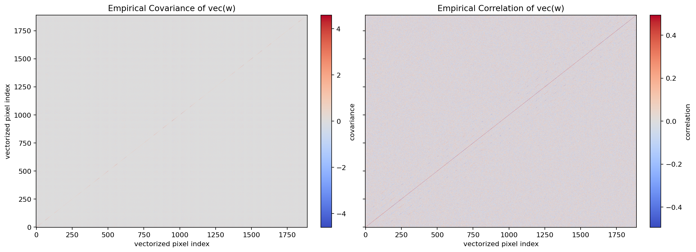
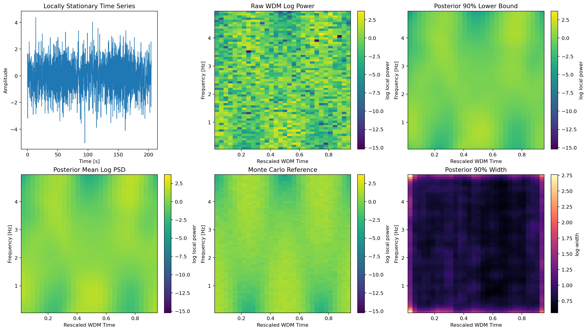
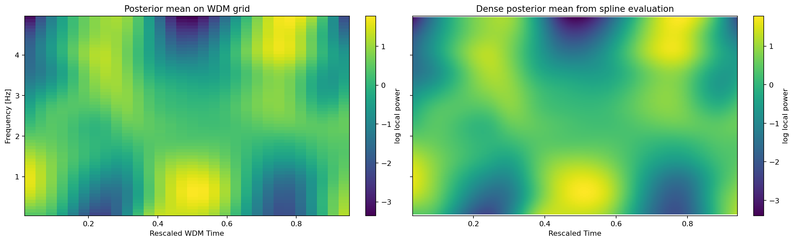
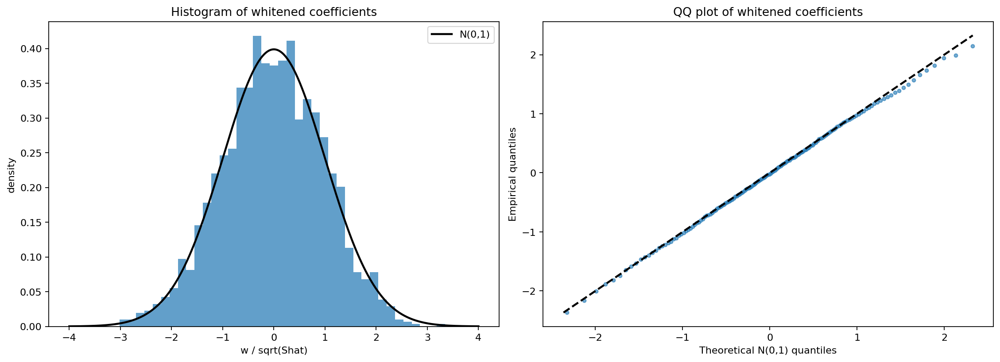
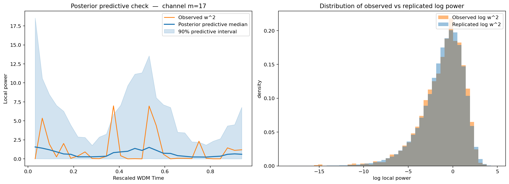
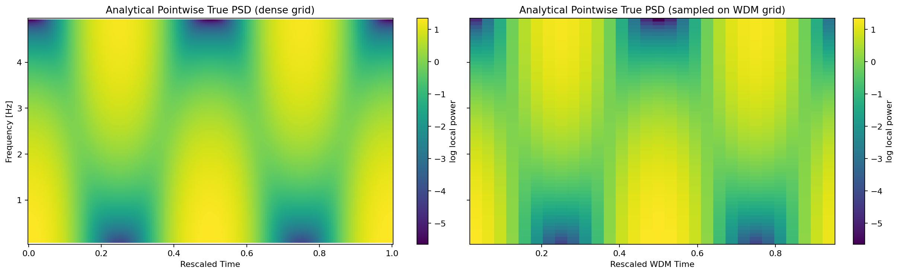
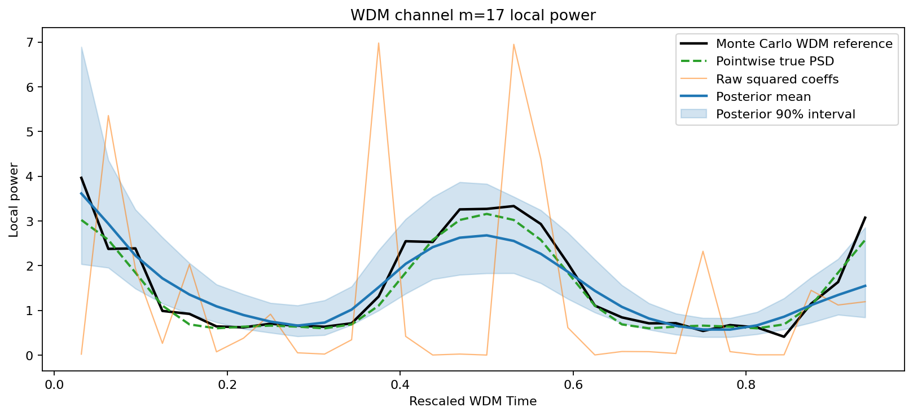

# Time-Varying WDM PSD

Executable script: [`tv_psd.py`](./tv_psd.py).


This study adapts the "moving PSD + spline surface" idea to the WDM domain.

Notation used throughout:

- `n` indexes WDM time bins
- `m` indexes WDM frequency channels
- `w_{nm}` is an observed WDM coefficient
- `S_{nm}` is the latent local power to be inferred
- `u_n \in [0,1]` is the rescaled WDM time coordinate
- `\nu_m` is the WDM frequency coordinate

The key substitution is simple:

- in the Fourier workflow, the noisy local power observation is a moving periodogram
- in the WDM workflow, the noisy local power observation is the squared WDM
  coefficients induced by a diagonal Gaussian likelihood on `w_{nm}`

Under the approximate diagonal WDM likelihood from the manuscript,
each WDM pixel behaves like

$$
w_{nm} \sim \mathcal{N}(0, S_{nm}),
$$

where `S_nm` is the local evolutionary power on the WDM grid. That means a
single realization of `w_nm**2` plays the same role here that a local
periodogram does in the short-time Fourier picture.

In this study we:

- simulate one locally stationary time series
- transform it to WDM coefficients with the package API
- fit a smooth log-power surface with tensor-product B-splines
- use a lightweight NumPyro MCMC to quantify posterior uncertainty
- compare the inferred surface to a Monte Carlo reference built from many draws

The point is not to claim that this is the final word on WDM PSD estimation.
The point is to make the Bayesian Whittle construction explicit, inspect where
it works, and identify which ingredients matter most: the WDM tiling, the
spline prior, and the roughness penalty.

## References

- Piepho, H.-P., Boer, M. P., & Williams, E. R. (2022).
  [Two-dimensional P-spline smoothing for spatial analysis of plant breeding trials](https://doi.org/10.1002/bimj.202100212).
  *Biometrical Journal*, 64, 835–857. *(tensor-product spline surfaces on rectangular grids)*
- Tang, Y., Kirch, C., Lee, J. E., & Meyer, R. (2026).
  [Bayesian nonparametric spectral analysis of locally stationary processes](https://doi.org/10.1080/01621459.2025.2594191).
  *JASA*. *(same broad target; STFT framework — useful benchmark for the chi-squared DOF comparison)*
- Bach, P., & Klein, N. (2025).
  [Anisotropic multidimensional smoothing using Bayesian tensor product P-splines](https://doi.org/10.1007/s11222-025-10569-y).
  *Statistics and Computing*, 35, 43. *(Bayesian anisotropic penalties, pseudo-determinant terms)*
- Lim, S., Pyeon, S., & Jeong, S. (2025).
  [Penalty-Induced Basis Exploration for Bayesian Splines](https://arxiv.org/abs/2311.13481).
  *(changing the roughness operator matters more than adding knots)*

## Spline Surface And Roughness Prior

We model the log local power with a tensor-product spline surface:

$$
\log S_{nm}
=
\sum_{r=1}^{R_t}\sum_{s=1}^{R_f}
B_r^{(t)}(u_n)\,W_{rs}\,B_s^{(f)}(\nu_m),
$$

where `B_r^{(t)}` and `B_s^{(f)}` are B-spline basis functions in time and
frequency, and `W_{rs}` are the unknown spline coefficients.

The prior is built from derivative-based roughness matrices rather than simple
coefficient differences. For example, in time we form

$$
R_t[i,j] = \int B_i^{(q_t)}(u)\,B_j^{(q_t)}(u)\,du,
$$

and similarly in frequency. The resulting anisotropic prior is

$$
p(W \mid \phi_t,\phi_f)
\propto
\exp\left[
-\frac{\phi_t}{2}\operatorname{vec}(W)^\top(R_t \otimes I_f)\operatorname{vec}(W)
-\frac{\phi_f}{2}\operatorname{vec}(W)^\top(I_t \otimes R_f)\operatorname{vec}(W)
\right].
$$

This is closer to penalizing actual curvature of the latent surface in
physical coordinates than penalizing nearest-neighbor coefficient differences.

Relative to the references above:

- the tensor-product construction follows the same general spirit as
  Piepho et al. (2022) and Bach & Klein (2025)
- the Kronecker-structured penalties line up with the computational viewpoint
  highlighted in the pybaselines 2D Whittaker examples
- the present notebook is simpler than Bach & Klein (2025): we use a direct
  NumPyro implementation rather than their more fully developed Bayesian
  anisotropic P-spline framework

## Experiment

## Is A Diagonal WDM Likelihood Plausible?

Before fitting any Bayesian smoother, it is worth checking the core Whittle
assumption in the most direct way: vectorize the trimmed WDM array and look at
its empirical covariance over many simulated realizations.

Define

$$
y = \operatorname{vec}(w),
$$

where each entry of `y` is one trimmed WDM pixel `(n,m)`. If the diagonal WDM
likelihood were exact, then `Cov(y)` would be diagonal. In practice we only
expect it to be approximately diagonal.

The two heatmaps below show:

- left: empirical covariance of `vec(w)`
- right: empirical correlation of `vec(w)`

The correlation view is usually easier to interpret, because the marginal
variances vary across the WDM plane.



This version uses the Bayesian WDM Whittle likelihood directly on the trimmed
coefficients. The posterior is still regularized by the spline prior, but the
data term is the same Whittle form discussed in the manuscript. We also run
two sequential chains and report divergences, `n_eff`, and `r_hat` for the
smoothing hyperparameters and a few representative latent pixels.

We report two comparison targets:

- the Monte Carlo WDM reference, which estimates E[w_nm^2] directly
- the analytical pointwise PSD of the underlying DGP, sampled on the same
  WDM grid

The first is the more like-for-like benchmark for the current WDM model. The
second is still useful, but it mixes the WDM estimation problem with the extra
question of how atom-averaged local power relates to the pointwise Fourier PSD.

Interpretation:

- `divergences = 0` is a necessary basic check for NUTS
- `r_hat \approx 1` suggests different chains are mixing to the same region
- larger `n_eff` means more stable posterior summaries
- checking only `\phi_t` and `\phi_f` is not enough, so we also report a few
  representative latent `log_psd` pixels

## What Is The Posterior Estimating?

The easiest way to get confused in this notebook is to compare two surfaces
that look similar but are not actually the same mathematical object.

There are four distinct surfaces in play:

1. **Analytical pointwise PSD**

   $$
   S_{\mathrm{true}}(u,\omega).
   $$

   This is the exact Fourier-domain time-varying PSD of the simulated ARMA
   process. It is the smooth "ground-truth" function defined on continuous
   time-frequency coordinates.

2. **Analytical PSD sampled on the WDM grid**

   $$
   S_{\mathrm{true}}(u_n,\omega_m).
   $$

   This is just the same function evaluated at the WDM bin centers. It is
   still the pointwise Fourier PSD, but shown on the coarse grid used by the
   WDM fit.

3. **Expected WDM local power**

   $$
   S_{nm}^{\mathrm{wdm}}
   :=
   \mathbb{E}[w_{nm}^2]
   \approx
   \iint |g_{nm}(t,f)|^2 S_{\mathrm{true}}(t,f)\,dt\,df.
   $$

   This is the quantity naturally linked to the WDM coefficient variance.
   It is an atom-averaged version of the true PSD, not the pointwise PSD
   itself. If the true PSD varies slowly across one WDM atom, then
   `S_nm^wdm` and `S_true(u_n, omega_m)` are close. If not, they can differ.

4. **Posterior mean**

   $$
   \widehat{S}_{nm}^{\mathrm{post}}
   =
   \mathbb{E}[S_{nm}^{\mathrm{wdm}} \mid w].
   $$

   This is the Bayesian estimate produced by the spline model from one noisy
   realization. It targets the WDM-domain local power surface, not the
   continuous analytical PSD directly.

So the key comparison is:

- **analytical PSD**: the physical pointwise spectrum of the DGP
- **WDM local power**: what the WDM coefficients actually measure
- **posterior mean**: the estimate of that WDM local power from noisy data

That is why the posterior can look smoother and slightly different from the
analytical PSD even when the model is working correctly:

- the posterior targets an atom-averaged quantity
- each pixel is observed with heavy `\chi^2_1` noise
- the spline prior shrinks peaks downward and troughs upward

The dense posterior plot below should therefore be read as:

- "what smooth WDM local-power surface did the Bayesian model infer?"

not as:

- "the exact analytical Fourier PSD recovered without approximation."



The posterior surface above is shown on the native WDM grid. Since the latent
model is a smooth tensor-product spline, we can also evaluate its posterior
mean on a much denser plotting grid to visualize the fitted trend without the
coarse WDM pixelation.



## Whitening Check

A downstream use of `S[n,m]` is to whiten WDM coefficients via

$$
z_{nm} = \frac{w_{nm}}{\sqrt{\widehat{S}_{nm}}}.
$$

If the fitted surface is a reasonable WDM noise model, then these whitened
coefficients should look approximately standard normal: centered near zero and
with variance close to one.



## Posterior Predictive Check

Surface error alone can make a fit look worse than it is. A more relevant
question for later inference is:

- can the fitted Bayesian model generate raw WDM local powers that look like
  the observed ones?

To check this, we sample replicated coefficients from the posterior predictive
distribution

$$
w^{\mathrm{rep}}_{nm} \mid S_{nm} \sim \mathcal{N}(0, S_{nm}),
$$

transform them to local power, and compare the observed `w[n,m]^2` to the
resulting posterior predictive intervals.



## Pointwise True PSD Reference

For the simulation DGPs we also know the analytical pointwise time-varying
PSD. This is a different target from the Monte Carlo WDM reference:

- Monte Carlo reference: estimates E[w_nm^2] on the WDM grid
- true PSD reference: evaluates the Fourier-domain PSD S(u, omega) at the WDM
  channel center frequencies

These are not identical in principle, but comparing against both helps
separate "WDM local power estimation" from "recovery of the underlying
pointwise PSD".

Two plots are useful here:

- a dense analytical PSD plot, which shows the smooth underlying surface
- the same analytical PSD sampled on the coarse WDM grid used by the fit

If the sampled version looks blocky, that is mostly a grid-resolution effect,
not a statement that the underlying analytical PSD itself is rough.



## One channel slice

A single WDM frequency channel is easier to read than the full surface. The
line plot below shows how the posterior mean tracks the Monte Carlo reference
through time for the channel with the largest average reference power.

This is often the easiest place to spot the qualitative failure mode:

- peaks too low and troughs too high imply oversmoothing
- large errors near the ends suggest boundary effects
- very jagged posterior means suggest under-regularization



## Takeaway

The Whittle likelihood on WDM coefficients is conceptually correct: it is
the natural diagonal approximation for a locally stationary process observed
through a near-orthogonal time-frequency transform. But from a statistical
standpoint, each pixel contributes a single chi-squared(1) observation,
which has 141% relative noise. The spline prior regularizes this, but the
bias-variance tradeoff is severe for one realization.

Summary of findings:

- **The atom-averaging concern is real but misidentified**: the MC reference
  and the Bayesian estimate both target the same atom-averaged quantity, so
  the residual error is not from this source.
- **The real bottleneck is chi-squared(1) noise**: 141% CV per pixel forces
  aggressive smoothing under any reasonable prior.
- **Derivative-based roughness penalties** help more than coefficient
  differences, and the **WDM tiling** remains a major lever.
- For recovering the pointwise PSD rather than atom-averaged power, a
  deconvolution step accounting for the atom footprint would be needed, but
  that is a separate problem from the noise-reduction issue addressed here.

## Run log

This section is generated from the script's `print()` output.

<!-- BEGIN GENERATED RUN LOG -->
```text
Adjusted WDM tiling from nt=24 to nt=32 so that n_total=2048 factors into an even (nt, nf)=(32, 64) grid.
Largest off-diagonal absolute correlation: 0.494
Median off-diagonal absolute correlation: 0.062
Original WDM grid shape:         (32, 65)
Fitted interior grid shape:      (30, 63)
Raw trimmed-power relative err.: 1.491
Posterior mean relative error:   0.337
Posterior vs true PSD error:     0.292
MCMC chains:                     2
Divergences:                     0
phi_time: mean=36.90, n_eff=588.6, r_hat=0.997
phi_freq: mean=36.82, n_eff=328.7, r_hat=1.004
log_psd[center] at (15, 31): mean=0.17, n_eff=679.7, r_hat=0.997
log_psd[low_freq] at (15, 12): mean=1.53, n_eff=1274.0, r_hat=0.997
log_psd[high_freq] at (15, 50): mean=-1.24, n_eff=577.9, r_hat=1.004
Whitened coefficient mean:       -0.020
Whitened coefficient variance:   0.966
Posterior predictive 90% coverage of observed w^2: 0.898
```
<!-- END GENERATED RUN LOG -->
